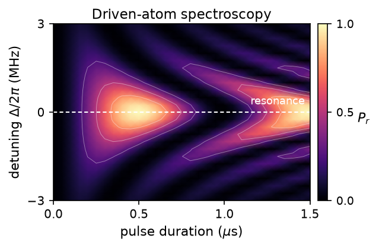

# User guide

Choose the level of detail that answers your question. Every path starts from
the same backend-independent [`Program`][fatqat.Program], so moving from an
algorithm study to a hardware or physics study does not require a second
authoring model.

-   { loading=lazy width="636" height="409" }

    :material-chart-bell-curve-cumulative: **Explore the algorithm**

    Start with ideal circuit behavior, inspect states and measurements, then add
    controlled noise and measure performance.

    [Start with simulation :material-arrow-right:](simulation.md)

-   { loading=lazy width="490" height="400" }

    :material-chip: **Test hardware constraints**

    Add topology, native operations, placement, occupancy, movement, and
    reference noise without changing the logical workload.

    [Open hardware-profile simulation :material-arrow-right:](hardware-profile-simulation.md)

-   { loading=lazy width="639" height="418" }

    :material-atom: **Follow the physics**

    Resolve calibrated gates and direct pulse controls into continuous dynamics
    for transmons and neutral atoms.

    [Open Hamiltonian emulation :material-arrow-right:](hamiltonian-emulation.md)

## One Program, three levels

| Question | Execution target | Typical answer |
| --- | --- | --- |
| What does the algorithm do? | General simulator | Counts, states, expectations, or a unitary |
| Does it fit this device profile? | Hardware-profile simulator | Native-operation, layout, and noise behavior |
| What dynamics produce it? | Hamiltonian emulator | Time evolution, leakage, occupancy, and pulse effects |

## Begin with a working program

New to FatQat? [Build and run a Bell program](quickstart.md). It takes about
ten minutes and ends with a circuit drawing and a counts plot.

When you are ready to go beyond the first circuit, [write a richer
Program](program.md). That chapter introduces named registers, classical
control, reusable parameters, and mixed qubit–qutrit systems without changing
the authoring model.

!!! tip

    The guide teaches complete workflows and the reasoning behind them. Follow a
    link to the [API reference](../api/index.md) when you need a precise signature
    or contract. The [tutorials](../tutorials/index.md) are longer case studies
    built on the same features.
