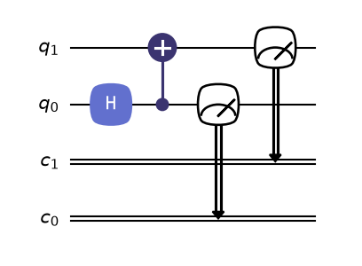

# Build, draw, and run one Program

In about ten minutes, you will create a Bell pair, draw its circuit, run 1,000
shots, and see why only `00` and `11` appear. The computation will live in a
[`Program`][fatqat.Program] from start to finish.

## Install FatQat from source

FatQat is not yet published on PyPI. Clone the repository, create an isolated
environment, and install the checkout:

```bash
git clone https://github.com/BoxiLi/fatqat.git
cd fatqat
python -m venv .venv
```

Activate the environment with the command for your platform:

```bash
# macOS or Linux
source .venv/bin/activate

# Windows PowerShell
.venv\Scripts\Activate.ps1
```

Then install FatQat:

```bash
python -m pip install --upgrade pip
python -m pip install .
```

## Write a Bell-state Program

A `Program` records the logical resources and instructions in execution
order. This one prepares two qubits in a Bell state and measures both of them:

```pycon
>>> import fatqat as fq
>>> import fatqat.operations as ops
>>> program = fq.Program(2, 2)
>>> program.add(ops.H, 0)
>>> program.add(ops.CX, (0, 1))
>>> program.measure_all()
```

`Program(2, 2)` creates two qubits and two classical bits. `H` puts qubit 0
into a superposition, and `CX` uses qubit 0 as its control and qubit 1 as its
target. The final instruction writes both quantum outcomes to the classical
bits.

The Program describes *what* should happen. It has not selected a simulator
or performed any evolution yet.

## Inspect the Program

Drawing is a native Program capability built on QuTiP-QIP's circuit drawing
tools. FatQat translates the Program's instructions for that renderer. The
default renderer returns a Matplotlib figure that you can display or save:

```pycon
>>> figure = program.draw()
>>> len(figure.axes)
1
```



??? example "Reproduce this figure"

    ```python
    import matplotlib.pyplot as plt
    import fatqat as fq
    import fatqat.operations as ops

    program = fq.Program(2, 2)
    program.add(ops.H, 0)
    program.add(ops.CX, (0, 1))
    program.measure_all()
    fig, ax = plt.subplots(figsize=(8, 3))
    for qubit in range(2):
        ax.plot((0, 4), (qubit, qubit), color="0.45", linewidth=1.2)
    ax.text(0.7, 0, "H", ha="center", va="center", color="white",
            bbox={"boxstyle": "round,pad=.35", "fc": "C0", "ec": "C0"})
    ax.scatter(1.8, 0, s=42, color="C3", zorder=3)
    ax.plot((1.8, 1.8), (0, 1), color="C3", linewidth=1.5)
    ax.scatter(1.8, 1, s=160, facecolor="white", edgecolor="C3", linewidth=1.5)
    ax.text(1.8, 1, "+", ha="center", va="center", color="C3", fontsize=13)
    for qubit in range(2):
        ax.text(3.1, qubit, "M", ha="center", va="center", color="white",
                bbox={"boxstyle": "round,pad=.32", "fc": "C2", "ec": "C2"})
        ax.text(-0.12, qubit, f"q{qubit}", ha="right", va="center")
    ax.set(xlim=(-0.4, 4.1), ylim=(1.55, -0.55))
    ax.axis("off")
    fig.tight_layout()
    ```

For a terminal-friendly version, `program.draw("text")` returns a string
instead of printing it. Drawing is a view of the recorded instruction
structure; it does not run the Program.

## Run it

The general-purpose simulator follows the Program's logical circuit
evolution. `run()` submits the Program and returns a
[`job`][fatqat.Job]. Calling `job.result()` waits for completion and
gives you a [`Result`][fatqat.Result] containing the requested
outputs:

```pycon
>>> backend = fq.simulator.Simulator()
>>> job = backend.run(
...     program,
...     shots=1000,
...     simulation_config={"seed": 7},
... )
>>> result = job.result()
>>> counts = result.get_counts()
>>> sorted(counts)
['00', '11']
>>> sum(counts.values())
1000
```

Each shot ends as either `00` or `11`: the two measured bits agree because
the qubits are entangled. Their counts are close rather than exactly equal
because measurement samples the state. The fixed seed makes this particular
run reproducible.


??? example "Reproduce this figure"

    ```python
    import matplotlib.pyplot as plt
    import fatqat as fq
    import fatqat.operations as ops

    program = fq.Program(2, 2)
    program.add(ops.H, 0)
    program.add(ops.CX, (0, 1))
    program.measure_all()

    counts = (
        fq.simulator.Simulator(runtime="numpy")
        .run(program, shots=1000, simulation_config={"seed": 7})
        .result()
        .get_counts()
    )
    assert sorted(counts) == ["00", "11"]
    assert sum(counts.values()) == 1000

    outcomes = sorted(counts)
    fig, ax = plt.subplots(figsize=(5.2, 3.2))
    bars = ax.bar(
        outcomes,
        [counts[outcome] for outcome in outcomes],
        color="#4c78a8",
    )
    ax.bar_label(bars, padding=3)
    ax.set(
        xlabel="measured bit string",
        ylabel="shots",
        title="Bell-state outcomes",
    )
    ax.set_ylim(0, max(counts.values()) * 1.15)
    fig.tight_layout()
    ```

Keep this `Program`: the next chapters change the backend to explore logical
behavior, hardware constraints, and physical dynamics.

## Continue

- [Write quantum computations with Program](program.md) to use explicit
  registers, measurements, conditions, parameters, and qudits.
- [Choose how much physics to model](execution-models.md) to compare FatQat's
  execution paths.
- [Bring Programs to and from OpenQASM and Qiskit](interoperability.md) to
  connect an existing circuit workflow.
