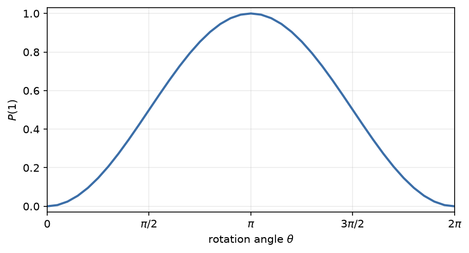

# Simulate a quantum program

Use the general-purpose [`Simulator`][fatqat.simulator.Simulator] to study
logical circuit evolution without choosing a hardware profile or Hamiltonian.
It applies the operations in a
[`Program`][fatqat.Program] as written: it does not transpile, route, or attach
device timing.

One reusable rotation will carry us from a state calculation to sampled
measurements and a parameter sweep.

## Start from a reusable Program

Keep the angle symbolic while you describe the computation. Binding creates a
new Program, so the template remains available for other values:

```pycon
>>> import math
>>> import numpy as np
>>> import fatqat as fq
>>> import fatqat.operations as ops
>>> theta = fq.Parameter("theta")
>>> rotation = fq.Program(1, 1)
>>> rotation.add(ops.RY(theta), 0)
>>> bound = rotation.assign_parameters({theta: math.pi / 2})
>>> backend = fq.simulator.Simulator(method="statevector", runtime="numpy")
>>> result = backend.run(bound).result()
>>> np.round(np.abs(result.get_statevector()) ** 2, 6).tolist()
[0.5, 0.5]
```

`RY(pi / 2)` prepares equal probabilities for `|0>` and `|1>`. The Program has
not been measured, so the natural answer is its final state. `runtime="numpy"`
keeps this small example free of compilation startup; [Performance and
scaling](performance.md) explains when to compare it with the Numba runtime.

Choose the representation for the output you need:

| If you need to know... | Start with |
| --- | --- |
| The pure state prepared by an ideal circuit | `method="statevector"` |
| The exact mixed state after finite noise channels | `method="density_matrix"` |
| The coherent transformation implemented by a small Program | `method="unitary"` |
| The complete channel implemented by a small Program | `method="superop"` |

These are different views of logical evolution, not different ways to author
the computation.

## Measure a distribution

To see the outcomes an experiment would report, copy the bound Program, append
a measurement, and request repeated shots:

```pycon
>>> measured = bound.copy()
>>> measured.measure(0, 0)
>>> counts = backend.run(
...     measured,
...     shots=200,
...     simulation_config={"seed": 7},
... ).result().get_counts()
>>> sum(counts.values())
200
>>> set(counts) <= {"0", "1"}
True
```

The two outcomes fluctuate around equal frequency. The seed makes this run
repeatable, but code should normally test the physics—allowed outcomes and
total shots—rather than one exact random dictionary. See [Ask questions of a
run](interpret-results.md) for count order and for choosing among the answers
stored in a Result.

## Sweep without rebuilding

[`run_sweep`][fatqat.simulator.Simulator.run_sweep] binds each row of values to
the same Program structure. Here the state itself is the useful answer, so no
measurement or sampling is needed:

```pycon
>>> angles = np.linspace(0.0, 2.0 * np.pi, 9)
>>> sweep = backend.run_sweep(
...     rotation,
...     {theta: angles},
...     result_config={"counts": False, "final_state": True},
... ).result()
>>> probability_one = np.array([
...     abs(item.get_statevector()[1]) ** 2 for item in sweep
... ])
>>> np.round(probability_one[[0, 4, 8]], 6).tolist()
[0.0, 1.0, 0.0]
```

The complete response curve makes the reuse visible:



??? example "Reproduce this figure"

    ```python
    import numpy as np
    import matplotlib.pyplot as plt
    import fatqat as fq
    import fatqat.operations as ops

    theta = fq.Parameter("theta")
    rotation = fq.Program(1, 1)
    rotation.add(ops.RY(theta), 0)

    angles = np.linspace(0.0, 2.0 * np.pi, 41)
    backend = fq.simulator.Simulator(method="statevector", runtime="numpy")
    results = backend.run_sweep(
        rotation,
        {theta: angles},
        result_config={"counts": False, "final_state": True},
    ).result()
    probability_one = np.array([
        abs(result.get_statevector()[1]) ** 2 for result in results
    ])

    assert np.allclose(probability_one, np.sin(angles / 2.0) ** 2)

    fig, ax = plt.subplots(figsize=(6.2, 3.4))
    ax.plot(angles, probability_one, color="#3b6ea8", linewidth=2)
    ax.set(
        xlabel=r"rotation angle $\theta$",
        ylabel=r"$P(1)$",
        xlim=(0.0, 2.0 * np.pi),
        ylim=(-0.03, 1.03),
    )
    ax.set_xticks(
        [0.0, np.pi / 2.0, np.pi, 3.0 * np.pi / 2.0, 2.0 * np.pi],
        ["0", r"$\pi/2$", r"$\pi$", r"$3\pi/2$", r"$2\pi$"],
    )
    ax.grid(alpha=0.25)
    fig.tight_layout()
    ```

A sweep returns ordinary Results in input order. For accepted method and batch
forms, see the [Simulator API](../api/simulator.md). Next, [Ask questions of
a run](interpret-results.md) follows counts, states, maps, and expectation
values through their shared Job and Result boundary.
