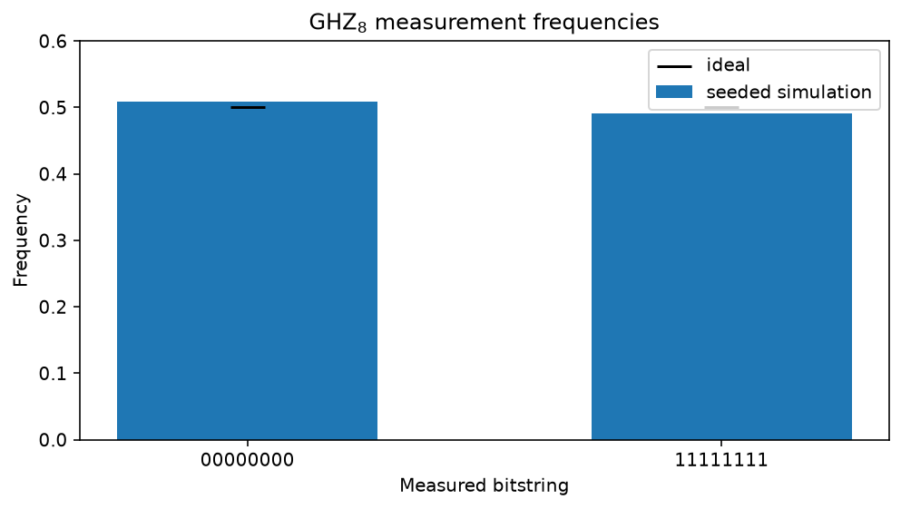

<!-- Generated by docs/mkdocs/tools/convert_tutorials.py. -->

# Entangle eight atoms into a GHZ state

<div class="grid cards" markdown>

-   :material-map-marker-path: **Track**

    Neutral-atom physics

-   :material-language-python: **Executable source**

    [Download `plot_atom_array_ghz8.py`](../downloads/tutorials/plot_atom_array_ghz8.py){ download }

</div>

This tutorial builds an eight-atom Greenberger-Horne-Zeilinger (GHZ) state on
[`AtomArraySimulator`][fatqat.simulator.AtomArraySimulator], fatqat's neutral-atom execution
target. It is a step up from the two-qubit Bell tutorial in two ways: the state
spans eight atoms instead of two, and the circuit runs on a backend whose
two-qubit-gate connectivity is *reconfigured mid-circuit* rather than fixed.

The GHZ state generalises the Bell state to $n$ qubits,

$$
|\mathrm{GHZ}_8\rangle
  = \frac{|00000000\rangle + |11111111\rangle}{\sqrt{2}}.
$$

Like the Bell state it cannot be factored into independent single-atom states.
Measuring all eight atoms yields *only* `00000000` or `11111111`, each with
probability one half, so every atom's outcome is perfectly correlated with
every other. That correlation alone, however, is also produced by a classical
coin flip that sets all eight bits together; what makes the GHZ state quantum
is that the two branches are held in *coherent superposition*, with a definite
relative phase. We will confirm the correlations with sampled counts and then
confirm the coherence with exact expectation values.

The neutral-atom twist is connectivity. On this backend a `CZ` acts only on a
pair of atoms that is currently *paired*. The [`Pair`][fatqat.operations.Pair] /
[`Unpair`][fatqat.operations.Unpair] operations update that pairing state as the
circuit runs. Physically, `Pair` stands for "move these two
atoms into a shared entangling zone" and `Unpair` for "move them apart
again" -- the atom transport that gives a reconfigurable neutral-atom processor
its programmable connectivity. We exploit exactly this to entangle atoms that
no fixed one-dimensional layout would place next to each other.

!!! info "Source-backed tutorial"

    The narrative and executable cells come from the tracked tutorial
    source. Validation-only source spans are not displayed.
    Runtime panels contain checked-in snapshots captured from that same
    source. Run the download directly to reproduce its plots and stdout.

## Imports and display settings

A [`fatqat.Program`][fatqat.Program] is the backend-independent circuit description.
Gate values live in [`fatqat.operations`](../api/operations.md). NumPy helps us tabulate
expectation values, and Matplotlib supplies the captured runtime figure.

```python title="Python cell 1"
import matplotlib.pyplot as plt
import numpy as np

import fatqat as fq
import fatqat.operations as ops

np.set_printoptions(precision=3, suppress=True)

NUM_ATOMS = 8
```

## The native gate set

The atom-array backend accepts only its native gates:
[`RX`][fatqat.operations.RX], [`RY`][fatqat.operations.RY],
[`RZ`][fatqat.operations.RZ], and [`CZ`][fatqat.operations.CZ]. Convenience
gates such as `H` and `CX` are not native here, so we compile them by hand
-- exactly what a hardware-aware transpiler would do. A Hadamard equals
$R_Z(\pi)$ followed by $R_Y(\pi/2)$ up to an irrelevant global
phase, and a controlled-X is a Hadamard-conjugated `CZ`:

$$
\mathrm{CX}(c \to t) = H_t \, \mathrm{CZ}(c, t) \, H_t.
$$

Writing these as small helpers keeps the circuit-building code below readable.

```python title="Python cell 2"
def native_h(program: fq.Program, target: int) -> None:
    """Hadamard in the native gate set: ``RZ(pi)`` then ``RY(pi/2)``."""
    program.add(ops.RZ(np.pi), target)
    program.add(ops.RY(np.pi / 2), target)


def native_cx(program: fq.Program, control: int, target: int) -> None:
    """``CX(control -> target)`` as ``H(target) CZ H(target)``.

    The ``CZ`` in the middle is valid only while ``control`` and ``target`` are
    currently paired; otherwise the backend raises
    :class:`~fatqat.errors.BackendValidationError`.
    """
    native_h(program, target)
    program.add(ops.CZ, (control, target))
    native_h(program, target)
```

## A log-depth entangling tree

We could grow the GHZ state with a chain of seven controlled-X gates, atom
`0` reaching each neighbour in turn. Instead we use a *binary tree*, which
reaches all eight atoms in only three layers and lets the gates within each
layer run in parallel on independent atom pairs:

```text
layer 1:  (0,4)                             1 CX  -- seeds the tree
layer 2:  (0,2) || (4,6)                    2 CX  in parallel
layer 3:  (0,1) || (2,3) || (4,5) || (6,7)  4 CX  in parallel
```

Every pair inside a layer is disjoint, so those controlled-X gates act on
separate atoms and could be executed simultaneously by the hardware.

```python title="Python cell 3"
CX_LAYERS: tuple[tuple[tuple[int, int], ...], ...] = (
    ((0, 4),),
    ((0, 2), (4, 6)),
    ((0, 1), (2, 3), (4, 5), (6, 7)),
)

for layer_index, layer in enumerate(CX_LAYERS, start=1):
    print(f"layer {layer_index}: " + " || ".join(f"CX{pair}" for pair in layer))
```

<!-- tutorial-result-start:cell-3 -->
!!! example "Runtime result"

    ```text
    layer 1: CX(0, 4)
    layer 2: CX(0, 2) || CX(4, 6)
    layer 3: CX(0, 1) || CX(2, 3) || CX(4, 5) || CX(6, 7)
    ```

<!-- tutorial-result-end:cell-3 -->

## Why the pairs must move between layers

The tree deliberately couples atoms that are far apart. Layer 1 entangles
atoms `0` and `4`; layer 2 needs `0` with `2` and `4` with `6`.
No fixed nearest-neighbour layout can offer all of those adjacencies at once.

This is where the reconfigurable connectivity earns its place. Just before a
layer's gates we [`Pair`][fatqat.operations.Pair] its atoms -- transporting
each pair into a shared entangling zone -- and just after we
[`Unpair`][fatqat.operations.Unpair] them, freeing the atoms for the next layer's
regrouping. If we skipped this rearrangement, the layer-2 and layer-3 `CZ`
gates would target atoms that are not paired and the backend would reject the
program with [`BackendValidationError`][fatqat.errors.BackendValidationError]. The transport is
not incidental to the algorithm; it *is* the algorithm's wiring.

```python title="Python cell 4"
def build_ghz8_program(*, measure: bool = True) -> fq.Program:
    """Assemble the eight-atom GHZ program.

    With ``measure=True`` every atom is read into a classical bit at the end,
    which is what the counts experiment needs. With ``measure=False`` the
    program has no classical register, leaving the coherent final state for the
    :class:`~fatqat.Estimator` to interrogate.
    """
    program = fq.Program(NUM_ATOMS, NUM_ATOMS if measure else 0)

    # Sites start empty; load one |0> atom into each of the eight traps.
    program.add(ops.Put, tuple(range(NUM_ATOMS)))

    # Seed the tree: put atom 0 into |+>, the root the branches grow from.
    native_h(program, 0)

    for layer in CX_LAYERS:
        for pair in layer:  # transport the layer's atoms together
            program.add(ops.Pair, pair)
        for control, target in layer:  # one parallel layer of CX = H CZ H
            native_cx(program, control, target)
        program.add(ops.Barrier, tuple(range(NUM_ATOMS)))  # visual layer marker
        for pair in layer:  # move the pairs apart again
            program.add(ops.Unpair, pair)

    if measure:
        program.measure_all()
    return program


ghz_program = build_ghz8_program()
```

## Sample the eight-atom experiment

We run the measured program on [`AtomArraySimulator`][fatqat.simulator.AtomArraySimulator],
sized to eight trap sites. A fixed seed keeps this page's numbers stable
across repeated tutorial runs; drop it for independent experimental samples.
Because the circuit is noiseless, every one of the 2000 shots lands on one of
the two GHZ branches -- no other bitstring appears.

```python title="Python cell 5"
shots = 2_000
backend = fq.simulator.AtomArraySimulator(num_sites=NUM_ATOMS)
counts = (
    backend.run(
        ghz_program,
        shots=shots,
        simulation_config={"seed": 7},
    )
    .result()
    .get_counts()
)

print("Counts:", counts)
```

<!-- tutorial-result-start:cell-5 -->
!!! example "Runtime result"

    ```text
    Counts: {'00000000': 1017, '11111111': 983}
    ```

<!-- tutorial-result-end:cell-5 -->

Only `00000000` and `11111111` occur, each in roughly half the shots. The
bars below show the observed frequencies against the ideal $1/2$;
finite-shot sampling nudges each bar slightly off that line, while every
intermediate bitstring stays empty.

```python title="Python cell 6"
all_zero, all_one = "0" * NUM_ATOMS, "1" * NUM_ATOMS
observed = np.array([counts.get(all_zero, 0), counts.get(all_one, 0)]) / shots

figure, axis = plt.subplots(figsize=(7, 4))
positions = np.arange(2)
axis.bar(positions, observed, width=0.55, label="seeded simulation")
axis.scatter(positions, [0.5, 0.5], color="black", marker="_", s=350, label="ideal")
axis.set(
    xticks=positions,
    xticklabels=(all_zero, all_one),
    xlabel="Measured bitstring",
    ylabel="Frequency",
    ylim=(0, 0.6),
    title="GHZ$_8$ measurement frequencies",
)
axis.legend()
figure.tight_layout()
plt.show()
```

<!-- tutorial-result-start:cell-6 -->
!!! example "Runtime result"

    

<!-- tutorial-result-end:cell-6 -->

## Correlated is not the same as coherent

The counts prove the eight atoms are perfectly *correlated*, but a classical
mixture -- an even coin flip between "all zero" and "all one" -- would give
the identical histogram. To see the quantum coherence we measure observables
the mixture and the superposition disagree on, using the exact
[`Estimator`][fatqat.Estimator] on the unmeasured state.

Two families pin down $|\mathrm{GHZ}_8\rangle$. Each neighbour parity
$\langle Z_i Z_{i+1}\rangle = 1$ says adjacent atoms always agree --
something the classical mixture also satisfies. The global
$X$-parity $\langle X_0 X_1 \cdots X_7\rangle = 1$ is the
discriminator: it equals $+1$ only for the coherent superposition and
averages to $0$ for the mixture. Observing both confirms a true GHZ
state.

```python title="Python cell 7"
zz_observables = []
for i in range(NUM_ATOMS - 1):
    label = ["I"] * NUM_ATOMS
    label[i] = label[i + 1] = "Z"
    zz_observables.append(fq.Observable([("".join(label), 1.0)]))
x_parity = fq.Observable([("X" * NUM_ATOMS, 1.0)])

estimator = fq.Estimator(fq.simulator.AtomArraySimulator(num_sites=NUM_ATOMS))
values = (
    estimator.run(
        build_ghz8_program(measure=False),
        zz_observables + [x_parity],
    )
    .result()
    .get_expectation()
)

for i, value in enumerate(values[:-1]):
    print(f"<Z{i}Z{i + 1}> = {value:+.6f}")
print(f"<{'X' * NUM_ATOMS}> = {values[-1]:+.6f}")
```

<!-- tutorial-result-start:cell-7 -->
!!! example "Runtime result"

    ```text
    <Z0Z1> = +1.000000
    <Z1Z2> = +1.000000
    <Z2Z3> = +1.000000
    <Z3Z4> = +1.000000
    <Z4Z5> = +1.000000
    <Z5Z6> = +1.000000
    <Z6Z7> = +1.000000
    <XXXXXXXX> = +1.000000
    ```

<!-- tutorial-result-end:cell-7 -->

Every witness returns $+1$, including the global $X$-parity, so
the state is the coherent GHZ superposition rather than a classical mixture
that would merely reproduce its counts.

## A cost of moving atoms around

Reconfigurable connectivity is not free: each transport step risks losing an
atom from its trap. We model that by attaching [`Loss`][fatqat.noise.Loss] to
the `Pair` and `Unpair` operations, which ejects an atom with some
probability whenever it is moved. Only this neutral-atom backend models atom
loss; a generic simulator rejects the same noise model.

A lost atom is not a `|0>` and not a `|1>`: it is *gone*, and reads out as
the erasure digit `2`, distinct from either computational outcome. Any shot
whose bitstring contains a `2` therefore had at least one atom fall out
during transport.

```python title="Python cell 8"
noise = fq.NoiseModel()
noise.add(fq.noise.Loss(p=0.01), operation=ops.Pair)
noise.add(fq.noise.Loss(p=0.01), operation=ops.Unpair)

lossy_backend = fq.simulator.AtomArraySimulator(num_sites=NUM_ATOMS, noise=noise)
lossy_counts = (
    lossy_backend.run(
        ghz_program,
        shots=shots,
        simulation_config={"seed": 7},
    )
    .result()
    .get_counts()
)

lost_shots = sum(n for bitstring, n in lossy_counts.items() if "2" in bitstring)
print(f"{lost_shots}/{shots} shots lost at least one atom (a '2' in the readout)")
print("Most frequent outcomes under 1% loss per move:")
for bitstring, n in sorted(lossy_counts.items(), key=lambda kv: -kv[1])[:6]:
    print(f"  {bitstring}: {n}")
```

<!-- tutorial-result-start:cell-8 -->
!!! example "Runtime result"

    ```text
    469/2000 shots lost at least one atom (a '2' in the readout)
    Most frequent outcomes under 1% loss per move:
      11111111: 799
      00000000: 732
      00020000: 48
      00000002: 48
      00000200: 30
      02000000: 29
    ```

<!-- tutorial-result-end:cell-8 -->

## Takeaways and next steps

This tutorial assembled a genuine eight-atom GHZ state, verified its
correlations from sampled counts and its coherence from exact expectation
values, and saw how moving atoms to reconfigure connectivity both enables the
log-depth entangling tree and introduces a realistic loss channel.

From here, try widening the tree to sixteen atoms by adding a fourth layer,
raising the loss probability to watch erasures grow, or intentionally
dropping the `Pair` / `Unpair` calls from one layer to see
[`AtomArraySimulator`][fatqat.simulator.AtomArraySimulator] reject the first unpaired
`CZ` with [`BackendValidationError`][fatqat.errors.BackendValidationError]. Restore the
pairing before exploring physical loss: an unpaired gate is a program error,
while a gate skipped after atom loss is a per-shot physical effect. The downloadable Python file is the canonical executable source, so these
variations can be made directly in runnable code.
