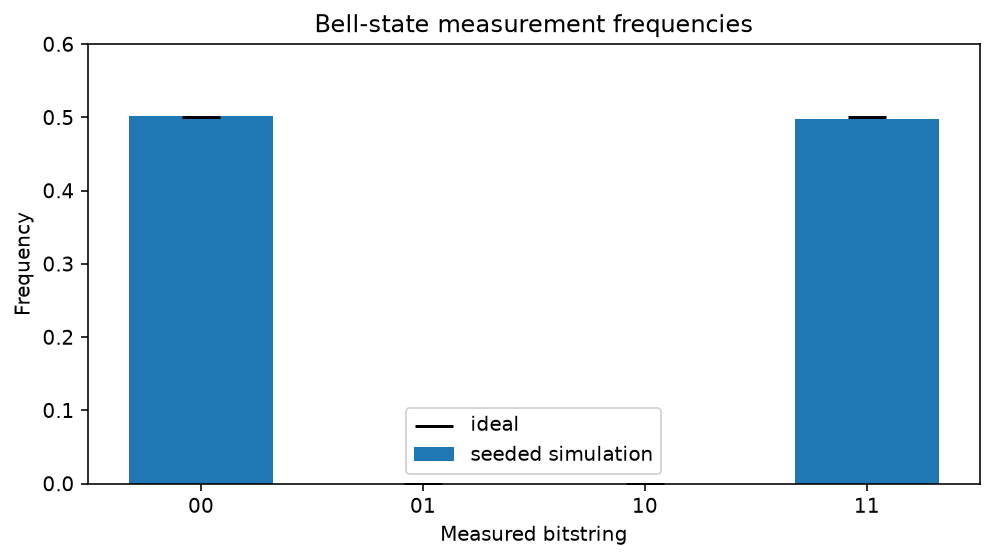

<!-- Generated by docs/mkdocs/tools/convert_tutorials.py. -->

# Prepare and measure a Bell state

<div class="grid cards" markdown>

-   :material-map-marker-path: **Track**

    Foundations

-   :material-language-python: **Executable source**

    [Download `plot_bell_state.py`](../downloads/tutorials/plot_bell_state.py){ download }

</div>

This tutorial builds the smallest entangled quantum system and follows it from
an exact statevector to finite-shot measurement data. Along the way, it shows
the distinction between a quantum state and the classical evidence collected
from repeated measurements.

For two qubits, the Bell state used here is

$$
|\Phi^+\rangle = \frac{|00\rangle + |11\rangle}{\sqrt{2}}.
$$

The ket cannot be factored into independent single-qubit states. Measuring
either qubit alone produces zero or one with equal probability, but the two
outcomes are perfectly correlated. In ideal sampling we therefore expect
$P(00)=P(11)=1/2$ and $P(01)=P(10)=0$.

We first inspect the exact amplitudes, then add measurements and collect
reproducible shot counts, and finally compare their observed frequencies with
the theoretical distribution in a figure.

!!! info "Source-backed tutorial"

    The narrative and executable cells come from the tracked tutorial
    source. Validation-only Sphinx-Gallery spans are not displayed.
    Runtime panels contain checked-in snapshots captured from that same
    source. Run the download directly to reproduce its plots and stdout.

## Imports and display settings

A `fatqat.Program` is the backend-independent circuit description. Gate
values live in `fatqat.operations`; fixed gates such as `H` and `CX`
are passed directly rather than constructed. NumPy helps us check the state,
and Matplotlib supplies the captured runtime figure.

```python title="Python cell 1"
import matplotlib.pyplot as plt
import numpy as np

import fatqat as fq
import fatqat.operations as ops

np.set_printoptions(precision=3, suppress=True)
```

## Build the entangling circuit

The system begins in $|00\rangle$. Applying a Hadamard gate to qubit
zero creates

$$
\frac{|00\rangle + |01\rangle}{\sqrt{2}},
$$

in fatqat's little-endian subsystem convention. The controlled-X then flips
qubit one exactly when qubit zero is one, producing
$|\Phi^+\rangle$. This first program has no classical register and no
measurements because we want the exact final state.

```python title="Python cell 2"
bell_program = fq.Program(2)
bell_program.add(ops.H, 0)
bell_program.add(ops.CX, (0, 1))
```

## Inspect the exact statevector

`method="SV"` selects statevector simulation. With no measurement, the
run is deterministic: one backend execution gives the exact final vector.
We disable counts and explicitly request the native final-state artifact.

```python title="Python cell 3"
backend = fq.simulator.Simulator(method="SV")
state_result = backend.run(
    bell_program,
    result_config={"counts": False, "final_state": True},
).result()
statevector = state_result.get_statevector()

print("Statevector:")
print(statevector)
print(f"Total probability: {np.vdot(statevector, statevector).real:.12f}")
```

<!-- tutorial-result-start:cell-3 -->
!!! example "Runtime result"

    ```text
    Statevector:
    [0.707+0.j 0.   +0.j 0.   +0.j 0.707+0.j]
    Total probability: 1.000000000000
    ```

<!-- tutorial-result-end:cell-3 -->

The basis order is $|00\rangle$, $|01\rangle$,
$|10\rangle$, $|11\rangle$. The printed vector therefore has
amplitudes $1/\sqrt{2}$ at indices zero and three and zero elsewhere.
The canonical source also checks that expectation with validation-only lines; this page omits those checks from displayed code.

```python title="Python cell 4"
probabilities = np.abs(statevector) ** 2
print("Exact basis probabilities:", probabilities)
```

<!-- tutorial-result-start:cell-4 -->
!!! example "Runtime result"

    ```text
    Exact basis probabilities: [0.5 0.  0.  0.5]
    ```

<!-- tutorial-result-end:cell-4 -->

## Add classical measurement

A sampled program needs two classical bits. We rebuild the short program so
its quantum instructions are unchanged, then measure quantum slots zero and
one into classical slots zero and one. Count strings are displayed with the
highest classical index on the left, so the correlated results appear as
`"00"` and `"11"`.

```python title="Python cell 5"
measured_program = fq.Program(2, 2)
measured_program.add(ops.H, 0)
measured_program.add(ops.CX, (0, 1))
measured_program.measure((0, 1), (0, 1))
```

## Sample a reproducible experiment

Finite-shot results fluctuate around the exact probabilities. A fixed seed
makes the tutorial's printed output stable across repeated tutorial runs;
applications that want independent experimental samples can omit it. The
seed controls sampling, not the state prepared by the gates.

```python title="Python cell 6"
shots = 1_000
sample_result = backend.run(
    measured_program,
    shots=shots,
    simulation_config={"seed": 7},
).result()
counts = sample_result.get_counts()

print("Seeded counts:", counts)
print("Available result data:", sorted(sample_result.available_data))
```

<!-- tutorial-result-start:cell-6 -->
!!! example "Runtime result"

    ```text
    Seeded counts: {'00': 502, '11': 498}
    Available result data: ['counts']
    ```

<!-- tutorial-result-end:cell-6 -->

## Compare observation with theory

For outcome $x$, the empirical frequency

$$
\hat{P}(x) = \frac{N_x}{N}
$$

estimates the Born probability. The dashed line marks the ideal probability
$1/2$ for both allowed outcomes. Sampling noise moves each bar slightly
away from that value, while the impossible `01` and `10` outcomes remain
absent in this noiseless circuit.

```python title="Python cell 7"
outcomes = ("00", "01", "10", "11")
observed = np.array([counts.get(outcome, 0) / shots for outcome in outcomes])
ideal = np.array([0.5, 0.0, 0.0, 0.5])

observed_by_outcome = {
    outcome: float(frequency) for outcome, frequency in zip(outcomes, observed)
}
print("Observed frequencies:", observed_by_outcome)

figure, axis = plt.subplots(figsize=(7, 4))
positions = np.arange(len(outcomes))
axis.bar(positions, observed, width=0.65, label="seeded simulation")
axis.scatter(positions, ideal, color="black", marker="_", s=350, label="ideal")
axis.set(
    xticks=positions,
    xticklabels=outcomes,
    xlabel="Measured bitstring",
    ylabel="Frequency",
    ylim=(0, 0.6),
    title="Bell-state measurement frequencies",
)
axis.legend()
figure.tight_layout()
plt.show()
```

<!-- tutorial-result-start:cell-7 -->
!!! example "Runtime result"

    ```text
    Observed frequencies: {'00': 0.502, '01': 0.0, '10': 0.0, '11': 0.498}
    ```

    

<!-- tutorial-result-end:cell-7 -->

The exact statevector and the sampled histogram answer different questions.
The vector describes the coherent state before observation, including its
amplitudes and relative phases. Counts describe classical outcomes after
measurement, and their precision is limited by `shots`. Increasing the
shot count narrows the statistical fluctuations but does not reveal phase
information; experiments that target phase require a different measurement
basis.

From here, try changing the Hadamard to `X`, removing the controlled-X, or
using the noise tools from the user guide. Because the downloadable Python source is canonical, each variation
can be explored without copying code out of a static screenshot.
