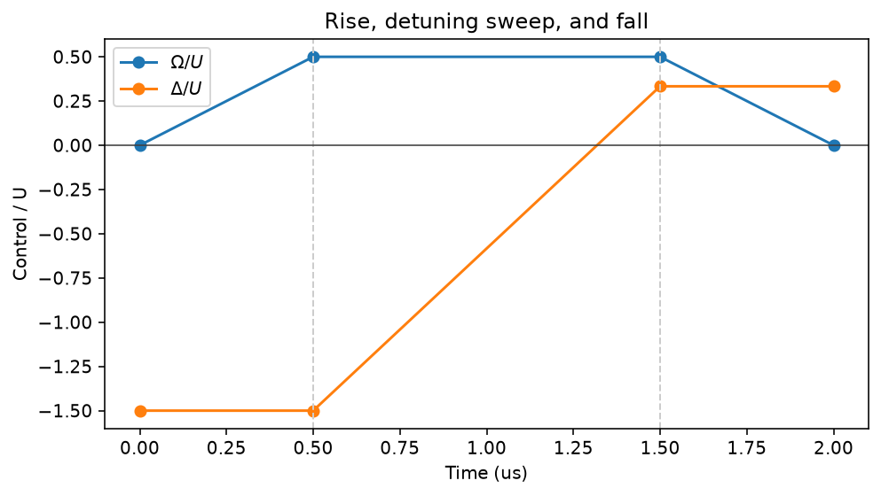

<!-- Generated by docs/mkdocs/tools/convert_tutorials.py. -->

# Tutorials

Go beyond the task-focused user guide with complete, deterministic case
studies. Each page alternates explanation and executable Python cells, and
includes the original source file for local exploration.

!!! tip "Choose a path"

    Begin with the Bell state if you are new to fatqat. The algorithms
    reuse the same parameter and execution model, while the neutral-atom
    track moves progressively closer to many-body hardware physics.

## Foundations

Start with a compact circuit whose exact state, samples, and visual interpretation can all be checked by hand.

-   [{ loading=lazy }](bell-state.md)

    :material-set-split:{ .lg .middle } **Prepare and measure a Bell state**

    ---

    Follow a two-qubit Bell state from exact amplitudes to seeded measurement counts and a comparison with the ideal distribution.

    [:material-arrow-right: Open tutorial](bell-state.md)

## Algorithms

Build parameterized programs once, then use optimizers, sweeps, and estimators to answer chemistry and machine-learning questions.

-   [{ loading=lazy }](vqe-h2.md)

    :material-chart-bell-curve-cumulative:{ .lg .middle } **Find the ground-state energy of H₂ with VQE**

    ---

    Run exact, finite-shot, and noisy VQE loops for molecular hydrogen and make the variational bound and sampling uncertainty explicit.

    [:material-arrow-right: Open tutorial](vqe-h2.md)

-   [{ loading=lazy }](qnn-digits.md)

    :material-brain:{ .lg .middle } **Recognize handwritten digits with a quantum neural network**

    ---

    Train a data-reuploading circuit to distinguish handwritten 3s and 6s while evaluating a whole parameter batch with one sweep.

    [:material-arrow-right: Open tutorial](qnn-digits.md)

## Neutral-atom physics

Move from programmable connectivity to continuous-time Rydberg dynamics and constrained many-body evolution.

-   [{ loading=lazy }](atom-array-ghz8.md)

    :material-atom:{ .lg .middle } **Entangle eight atoms into a GHZ state**

    ---

    Use dynamic Pair and Unpair operations to build an eight-atom GHZ state, then test both its correlations and coherent phase.

    [:material-arrow-right: Open tutorial](atom-array-ghz8.md)

-   [{ loading=lazy }](antiferromagnetic-chain.md)

    :material-sine-wave:{ .lg .middle } **Build antiferromagnetic correlations in a Rydberg chain**

    ---

    Design a three-stage Rydberg pulse from physical units and watch short-range antiferromagnetic order emerge in a ten-site chain.

    [:material-arrow-right: Open tutorial](antiferromagnetic-chain.md)

-   [{ loading=lazy }](pxp-z2-revival.md)

    :material-waveform:{ .lg .middle } **Revivals and entanglement growth in an open PXP chain**

    ---

    Trotterize the constrained PXP Hamiltonian and compare many-body revivals and half-chain entropy with an independent exact solve.

    [:material-arrow-right: Open tutorial](pxp-z2-revival.md)

