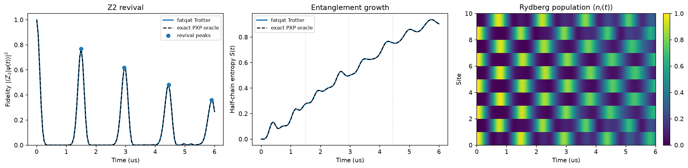

<!-- Generated by docs/mkdocs/tools/convert_tutorials.py. -->

# Revivals and entanglement growth in an open PXP chain

<div class="grid cards" markdown>

-   :material-map-marker-path: **Track**

    Neutral-atom physics

-   :material-language-python: **Executable source**

    [Download `plot_pxp_z2_revival.py`](../downloads/tutorials/plot_pxp_z2_revival.py){ download }

</div>

Push the Rydberg blockade to its strong-coupling extreme and you are left
with the PXP model, and quenching it from the Neel state produces one of the
strangest sights in many-body physics.

You would expect a ten-site chain to scramble and forget where it started.
The PXP chain, for the most part, does exactly that -- except when it starts
from $|Z_2\rangle = |r\,g\,r\,g\,\ldots\rangle$. That state keeps
snapping back to itself at regular intervals, a phenomenon tied to quantum
many-body scars (see [Turner et al., Nature Physics 14, 745 (2018)](https://doi.org/10.1038/s41567-018-0137-5)). Entanglement grows during the
quench, but it is not a one-way street either: every revival comes with a
visible dip in the half-chain entropy.

One practical wrinkle: fatqat's pulse emulators always start from the
all-ground state and only offer global controls, so they cannot host a quench
from $|Z_2\rangle$. The workaround below is to Trotterize the PXP
Hamiltonian into small custom gates and run them on the gate-level simulator,
which does accept an arbitrary `initial_state`. An independent QuTiP solve
of the exact PXP model checks every curve along the way.

!!! info "Source-backed tutorial"

    The narrative and executable cells come from the tracked tutorial
    source. Validation-only Sphinx-Gallery spans are not displayed.
    Runtime panels contain checked-in snapshots captured from that same
    source. Run the download directly to reproduce its plots and stdout.

## 1. Where PXP comes from: the blockade limit of the Rydberg Hamiltonian

Start from the Rydberg Hamiltonian,

$$
H(t) = \frac{\Omega(t)}{2}\sum_i X_i
       - \Delta(t)\sum_i n_i
       + \sum_{i<j} U_{ij} n_i n_j,
\qquad
n_i=|r\rangle\langle r|_i.
$$

Now crank $U$ up and set $\Delta=0$. Once two neighbouring
excitations cost more energy than anything else in the problem, "no two
neighbours both in $|r\rangle$" stops being a preference and becomes
a hard rule. Inside that constrained subspace, first-order perturbation
theory leaves

$$
H_{\mathrm{PXP}} = \frac{\Omega}{2}\sum_i P_{i-1} X_i P_{i+1},
\qquad
P_i = |g\rangle\langle g|_i = I - n_i,
$$

with open boundaries, meaning $P_{-1}=P_L=1$. Read each term out
loud: site $i$ may flip, but only while both of its neighbours sit in
$|g\rangle$. The bulk terms involve three sites; the two boundary
terms, $X_0 P_1$ and $P_{L-2}X_{L-1}$, only two.

A word on scope: this is an ideal model study. The constraint is imposed
exactly (not approximated by a big-but-finite $U$), and there is no
decoherence and no atom loss.

## 2. The Z2 state and why it revives

Two Neel configurations live inside the constrained subspace,

$$
|Z_2\rangle = |r\,g\,r\,g\,\ldots\rangle,
\qquad
|\bar Z_2\rangle = |g\,r\,g\,r\,\ldots\rangle.
$$

We prepare $|Z_2\rangle$, let it go, and watch the return probability
$F(t)=|\langle Z_2|\psi(t)\rangle|^2$. A handful of special scarred
eigenstates dominate this quench, so $F(t)$ oscillates with a period
near $T\approx 4.7/g$, where $g=\Omega/2$ is the PXP
coefficient. For the drive used below that means $T\approx 1.5$ us --
but rather than trusting the estimate, we will simply measure where the
peaks actually land.

## Imports, constants, and the Z2 vector

Ten sites, working in rad/us and us units, and the familiar drive scale $\Omega=2\pi$ rad/us, so the PXP coefficient is
$g=\pi$ rad/us. One convention to keep straight: fatqat stores the
amplitude of $|b_0\ldots b_9\rangle$ at index
$\sum_i b_i 2^i$ (site 0 is the least significant bit), so each Neel
state is a single basis vector -- just two index numbers to remember.

```python title="Python cell 1"
import matplotlib.pyplot as plt
import numpy as np
from scipy.signal import argrelextrema

import fatqat as fq

NUM_SITES = 10
HALF = NUM_SITES // 2
DIM = 2**NUM_SITES

OMEGA = 2 * np.pi  # rad/us -> PXP coefficient g = OMEGA / 2
T_MAX = 6.0  # us, covers the first three revivals
DT_TROTTER = 0.01  # us, one symmetric second-order Trotter step
TIME_GRID = np.linspace(0.0, T_MAX, 121)

Z2_BITS = tuple(1 - (i % 2) for i in range(NUM_SITES))  # |r g r g ...>
Z2_INDEX = sum(2**i for i in range(NUM_SITES) if Z2_BITS[i])
Z2 = np.zeros(DIM, dtype=complex)
Z2[Z2_INDEX] = 1.0

ALT_BITS = tuple(1 - bit for bit in Z2_BITS)  # the twin Neel branch
ALT_INDEX = sum(2**i for i in range(NUM_SITES) if ALT_BITS[i])
ALT = np.zeros(DIM, dtype=complex)
ALT[ALT_INDEX] = 1.0

print(f"Z2 branch |r g r g ...> sits at statevector index {Z2_INDEX}")
print(f"twin branch |g r g r ...> sits at statevector index {ALT_INDEX}")
```

<!-- tutorial-result-start:cell-1 -->
!!! example "Runtime result"

    ```text
    Z2 branch |r g r g ...> sits at statevector index 341
    twin branch |g r g r ...> sits at statevector index 682
    ```

<!-- tutorial-result-end:cell-1 -->

## 3. Trotterizing PXP into a fatqat program

Two constraints decided the approach. First, the pulse emulators always
start from $|g\ldots g\rangle$ and only offer global controls, so a
quench from $|Z_2\rangle$ is simply not expressible there; the
gate-level [`Simulator`][fatqat.simulator.Simulator], on the other hand, happily
accepts an `initial_state`. Second, no native gate set contains a PXP
term -- but that is exactly what fatqat's custom-operation extension point
is for: [`MatrixImplementationMap`][fatqat.implementation.MatrixImplementationMap] resolves any
fixed-arity operation family to a local matrix at execution time.

The exponentials we need are easy to write down. With $M=PXP$ and
$M^2=P\otimes I\otimes P$,

$$
e^{-i\theta M}
  = I + (\cos\theta - 1)\,P\otimes I\otimes P - i\sin\theta\,M.
$$

Concretely, that is a $2\times 2$ rotation between
$|ggg\rangle$ and $|grg\rangle$ for a bulk term, and between
$|gg\rangle$ and $|rg\rangle$ (left edge) or $|gg\rangle$
and $|gr\rangle$ (right edge) for the boundary terms. Each matrix is
built once, checked to be unitary, and registered under its operation
class.

Now for the actual time evolution. We want $e^{-iH_{\mathrm{PXP}}dt}$,
where $H_{\mathrm{PXP}}=\sum_j h_j$ with $h_j=(\Omega/2)M_j$.
The $h_j$'s do not commute, so the exponential does not factor into a
product of the individual $e^{-ih_j dt}$'s -- it has to be
approximated. The first-order Trotter formula just sweeps the terms once,

$$
e^{-iH dt} \;\approx\;
\prod_{j=0}^{L-1} e^{-i h_j dt}
\;=\; e^{-iH dt} + \mathcal{O}(dt^2),
$$

and its leading error is a commutator of the $h_j$'s. A symmetric
(Strang) step removes that leading error: split every term into two half
angles, sweep forward, then sweep the same half angles backward,

$$
e^{-iH dt} \;\approx\;
\left(\prod_{j=0}^{L-1} e^{-i h_j dt/2}\right)
\left(\prod_{j=L-1}^{0} e^{-i h_j dt/2}\right)
\;=\; e^{-iH dt} + \mathcal{O}(dt^3).
$$

In code, the forward pass is `for site in range(NUM_SITES)` -- left edge,
then the bulk terms, then the right edge -- and the backward pass is the
same loop in reverse. Each half-step exponent is $h_j\,dt/2$, and
$h_j$ already carries $\Omega/2$, so every registered matrix
uses the one angle $\theta=\Omega\,dt/4$. Repeating this symmetric
step `round(duration / dt)` times walks the quench out to any duration.

A small warning from experience: when fatqat flattens a local matrix, the
FIRST target is the most significant bit -- index
$b_{t_0}\cdot 2^{k-1} + \cdots + b_{t_{k-1}}$. It is easy to get
this backwards (we did), and the result is silently wrong dynamics rather
than an error message.

```python title="Python cell 2"
from dataclasses import dataclass
from typing import ClassVar

from fatqat.operations import Operation

THETA = OMEGA * DT_TROTTER / 4


@dataclass(frozen=True)
class PXPBulk(Operation):
    """Three-site PXP exponential: X on the middle site guarded by two P's."""

    name: ClassVar[str] = "PXPBulk"
    num_subsystems: ClassVar[int] = 3


@dataclass(frozen=True)
class PXPEdgeLeft(Operation):
    """Left boundary term X_0 P_1."""

    name: ClassVar[str] = "PXPEdgeLeft"
    num_subsystems: ClassVar[int] = 2


@dataclass(frozen=True)
class PXPEdgeRight(Operation):
    """Right boundary term P_{L-2} X_{L-1}."""

    name: ClassVar[str] = "PXPEdgeRight"
    num_subsystems: ClassVar[int] = 2


def _rotation_matrix(dimension: int, pair: tuple[int, int], angle: float) -> np.ndarray:
    """Identity except for a 2x2 exp(-i angle X) rotation on ``pair``."""
    matrix = np.eye(dimension, dtype=complex)
    first, second = pair
    matrix[first, first] = matrix[second, second] = np.cos(angle)
    matrix[first, second] = matrix[second, first] = -1j * np.sin(angle)
    return matrix


# fatqat flattens local matrices with the FIRST target as the most
# significant bit: index = b_{t0} * 2**(k-1) + ... + b_{t_{k-1}}.
# Keep that in mind or the edge terms quietly act on the wrong site.
# Bulk (i-1, i, i+1): flip the middle site -> pair (|ggg>, |grg>) = (0, 2).
BULK_MATRIX = _rotation_matrix(8, (0, 2), THETA)
# Left edge (0, 1): flip site 0 -> pair (|gg>, |rg>) = (0, 2).
EDGE_LEFT_MATRIX = _rotation_matrix(4, (0, 2), THETA)
# Right edge (L-2, L-1): flip site L-1 -> pair (|gg>, |gr>) = (0, 1).
EDGE_RIGHT_MATRIX = _rotation_matrix(4, (0, 1), THETA)


implementation_map = fq.implementation.MatrixImplementationMap()
implementation_map.add(PXPBulk, BULK_MATRIX)
implementation_map.add(PXPEdgeLeft, EDGE_LEFT_MATRIX)
implementation_map.add(PXPEdgeRight, EDGE_RIGHT_MATRIX)

# NumPy runtime on purpose: the program is thousands of tiny local
# operations, and at that size the Python loop dwarfs any matrix kernel,
# so numba would only add compile time.
backend = fq.simulator.Simulator(
    method="SV",
    runtime="numpy",
    implementation_map=implementation_map,
)


def trotter_program(duration: float) -> fq.Program:
    """Build the symmetric second-order Trotter program for ``duration``."""
    steps = int(round(duration / DT_TROTTER))
    program = fq.Program(NUM_SITES)
    for _ in range(steps):
        for site in range(NUM_SITES):  # forward half pass
            if site == 0:
                program.add(PXPEdgeLeft(), (0, 1))
            elif site == NUM_SITES - 1:
                program.add(PXPEdgeRight(), (NUM_SITES - 2, NUM_SITES - 1))
            else:
                program.add(PXPBulk(), (site - 1, site, site + 1))
        for site in range(NUM_SITES - 1, -1, -1):  # backward half pass
            if site == 0:
                program.add(PXPEdgeLeft(), (0, 1))
            elif site == NUM_SITES - 1:
                program.add(PXPEdgeRight(), (NUM_SITES - 2, NUM_SITES - 1))
            else:
                program.add(PXPBulk(), (site - 1, site, site + 1))
    return program


def evolve_fatqat(duration: float) -> np.ndarray:
    """Quench |Z2> for ``duration`` and return the final statevector."""
    if duration == 0.0:
        return Z2.copy()
    result = backend.run(
        trotter_program(duration),
        initial_state=Z2,
        result_config={"counts": False, "final_state": True},
    ).result()
    return result.get_statevector()
```

<!-- tutorial-result-start:cell-2 -->
!!! example "Runtime result"

    ```text
    bulk term matrix is unitary (8x8)
    left edge term matrix is unitary (4x4)
    right edge term matrix is unitary (4x4)
    ```

<!-- tutorial-result-end:cell-2 -->

## 4. The exact oracle

Never trust a hand-built Trotter circuit without a second opinion. fatqat's
own physics tests check numerics against an independent oracle, so we do
the same here: assemble the exact PXP Hamiltonian directly with QuTiP and
solve it once over the whole time grid, starting from the same
$|Z_2\rangle$ vector.

```python title="Python cell 3"
import qutip

_P = (qutip.qeye(2) + qutip.sigmaz()) / 2  # |g><g|
_X = qutip.sigmax()
_I2 = qutip.qeye(2)


def _pxp_term(site: int) -> "qutip.Qobj":
    factors = [_I2] * NUM_SITES
    factors[site] = _X
    if site - 1 >= 0:
        factors[site - 1] = _P
    if site + 1 < NUM_SITES:
        factors[site + 1] = _P
    return qutip.tensor(*factors)


ORACLE_H = sum((OMEGA / 2) * _pxp_term(site) for site in range(NUM_SITES))
ORACLE_Z2 = qutip.tensor(*[qutip.basis(2, bit) for bit in Z2_BITS])
ORACLE_RESULT = qutip.sesolve(ORACLE_H, ORACLE_Z2, list(TIME_GRID))

# Gotcha: QuTiP's tensor() treats the FIRST factor as the most significant
# bit, while fatqat puts site 0 at the least significant bit. Same physics,
# differently labelled basis -- so every oracle vector is bit-reversed into
# fatqat's convention before we compare anything.
def _bit_reversal_permutation() -> np.ndarray:
    permutation = np.empty(DIM, dtype=int)
    for index in range(DIM):
        reversed_index = 0
        for site in range(NUM_SITES):
            reversed_index |= ((index >> site) & 1) << (NUM_SITES - 1 - site)
        permutation[index] = reversed_index
    return permutation


_ORACLE_PERMUTATION = _bit_reversal_permutation()


def evolve_oracle(index: int) -> np.ndarray:
    """Return the oracle statevector at grid index ``index``, fatqat-ordered."""
    vector = np.asarray(ORACLE_RESULT.states[index].full()).reshape(-1)
    return vector[_ORACLE_PERMUTATION]
```

## 5. What to measure: fidelity and half-chain entropy

Two numbers tell the whole story. The fidelity
$F(t)=|\langle Z_2|\psi(t)\rangle|^2$ says how much of the state
comes back, and the fidelity to the twin branch tells us whether a revival
lands on the *same* Neel orientation or the mirrored one. The half-chain
von Neumann entropy

$$
S(t) = -\mathrm{Tr}\left[\rho_A\ln\rho_A\right],
\qquad
\rho_A = \mathrm{Tr}_B|\psi(t)\rangle\langle\psi(t)|,
$$

with $A$ the first five sites, tracks how entangled the two halves
get. Both curves come from the same small helpers, so the fatqat and
oracle numbers are directly comparable.

```python title="Python cell 4"
def fidelity(state: np.ndarray, reference: np.ndarray) -> float:
    """Return |<reference|state>|^2 for two statevectors."""
    return float(abs(np.vdot(reference, state)) ** 2)


def half_chain_entropy(state: np.ndarray) -> float:
    """Von Neumann entropy of the first-half subsystem, via the SVD."""
    schmidt = np.linalg.svd(state.reshape(2**HALF, 2**HALF), compute_uv=False)
    probabilities = schmidt**2
    probabilities = probabilities[probabilities > 0.0]
    return -float(np.sum(probabilities * np.log(probabilities)))


def site_occupations(state: np.ndarray) -> np.ndarray:
    """Marginal |r> population of every site from one statevector."""
    basis_indices = np.arange(DIM)
    return np.array(
        [
            float(np.sum(np.abs(state) ** 2 * ((basis_indices >> site) & 1)))
            for site in range(NUM_SITES)
        ]
    )
```

## 6. Run the quench and collect the time series

For each grid time we rebuild the Trotter program (it grows with the
duration) and evolve it once from $|Z_2\rangle$; the oracle hands us
the corresponding exact state. It is a bit of a brute-force way to sample
a time axis, but it keeps everything on the public API -- and the ten-site
chain is small enough that it finishes in seconds.

```python title="Python cell 5"
fatqat_states = [evolve_fatqat(t) for t in TIME_GRID]

fatqat_fidelity = np.array([fidelity(s, Z2) for s in fatqat_states])
fatqat_alt = np.array([fidelity(s, ALT) for s in fatqat_states])
fatqat_entropy = np.array([half_chain_entropy(s) for s in fatqat_states])
fatqat_occupations = np.array([site_occupations(s) for s in fatqat_states])

oracle_fidelity = np.array(
    [fidelity(evolve_oracle(i), Z2) for i in range(len(TIME_GRID))]
)
oracle_entropy = np.array(
    [half_chain_entropy(evolve_oracle(i)) for i in range(len(TIME_GRID))]
)

max_gap = float(np.max(np.abs(fatqat_fidelity - oracle_fidelity)))
print(f"Largest fidelity gap between Trotter and oracle: {max_gap:.5f}")
```

<!-- tutorial-result-start:cell-5 -->
!!! example "Runtime result"

    ```text
    Largest fidelity gap between Trotter and oracle: 0.00059
    ```

<!-- tutorial-result-end:cell-5 -->

Revival peaks are just local maxima of the fidelity after the initial
decay. Notice that each peak lands on the *same* Neel branch -- the
twin-branch fidelity stays negligible there, so the state really does
come back to where it started.

```python title="Python cell 6"
peaks = argrelextrema(fatqat_fidelity, np.greater, order=4)[0]
peaks = [p for p in peaks if TIME_GRID[p] > 0.2 and fatqat_fidelity[p] > 0.2]

print("\nRevivals of the |Z2> quench (fatqat Trotter):")
print(f"{'time (us)':>10} {'F(Z2)':>8} {'F(alt)':>8} {'S(t)':>8}")
for p in peaks[:4]:
    print(
        f"{TIME_GRID[p]:>10.2f} {fatqat_fidelity[p]:>8.3f} "
        f"{fatqat_alt[p]:>8.3f} {fatqat_entropy[p]:>8.3f}"
    )

first_peak_time = TIME_GRID[peaks[0]]
first_peak_fidelity = fatqat_fidelity[peaks[0]]
first_peak_entropy = fatqat_entropy[peaks[0]]
print(f"Entropy maximum: {fatqat_entropy.max():.3f}")
```

<!-- tutorial-result-start:cell-6 -->
!!! example "Runtime result"

    ```text

    Revivals of the |Z2> quench (fatqat Trotter):
     time (us)    F(Z2)   F(alt)     S(t)
          1.50    0.768    0.000    0.278
          2.95    0.618    0.000    0.496
          4.45    0.482    0.007    0.753
          5.90    0.359    0.005    0.918
    Entropy maximum: 0.938
    ```

<!-- tutorial-result-end:cell-6 -->

## 7. Read the revival and the entropy growth

The left panel is the money plot: three revivals around
$t\approx 1.5, 3.0, 4.5$ us, each a little weaker than the last --
the fingerprint of PXP scars. The middle panel shows why these dynamics
are not thermal: the half-chain entropy grows, but it *dips* at every
revival, as if the state briefly remembered how to be a product state
again. The right panel tells the same story in real space, with the Neel
stripes melting during the quench and partially reassembling each time the
fidelity peaks.

```python title="Python cell 7"
figure, (fid_axis, ent_axis, occ_axis) = plt.subplots(1, 3, figsize=(16, 4))

fid_axis.plot(
    TIME_GRID,
    fatqat_fidelity,
    label="fatqat Trotter",
    linewidth=2,
)
fid_axis.plot(TIME_GRID, oracle_fidelity, "k--", label="exact PXP oracle")
fid_axis.scatter(
    TIME_GRID[peaks],
    fatqat_fidelity[peaks],
    color="C0",
    marker="o",
    zorder=3,
    label="revival peaks",
)
fid_axis.set(
    xlabel="Time (us)",
    ylabel=r"Fidelity $|\langle Z_2|\psi(t)\rangle|^2$",
    ylim=(0, 1.05),
    title="Z2 revival",
)
fid_axis.legend(fontsize="small")

ent_axis.plot(TIME_GRID, fatqat_entropy, label="fatqat Trotter", linewidth=2)
ent_axis.plot(TIME_GRID, oracle_entropy, "k--", label="exact PXP oracle")
for p in peaks[:3]:
    ent_axis.axvline(TIME_GRID[p], color="0.8", linestyle=":", linewidth=1)
ent_axis.set(
    xlabel="Time (us)",
    ylabel=r"Half-chain entropy $S(t)$",
    title="Entanglement growth",
)
ent_axis.legend(fontsize="small")

image = occ_axis.imshow(
    fatqat_occupations.T,
    aspect="auto",
    origin="lower",
    extent=(TIME_GRID[0], TIME_GRID[-1], 0, NUM_SITES),
    cmap="viridis",
)
occ_axis.set(
    xlabel="Time (us)",
    ylabel="Site",
    title=r"Rydberg population $\langle n_i(t)\rangle$",
)
figure.colorbar(image, ax=occ_axis, fraction=0.046, pad=0.04)
figure.tight_layout()
plt.show()
```

<!-- tutorial-result-start:cell-7 -->
!!! example "Runtime result"

    

<!-- tutorial-result-end:cell-7 -->
