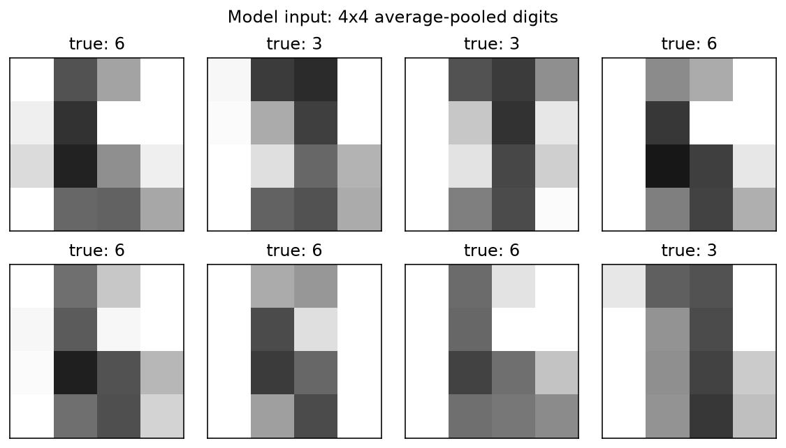

<!-- Generated by docs/mkdocs/tools/convert_tutorials.py. -->

# Recognize handwritten digits with a quantum neural network

<div class="grid cards" markdown>

-   :material-map-marker-path: **Track**

    Algorithms

-   :material-language-python: **Executable source**

    [Download `plot_qnn_digits.py`](../downloads/tutorials/plot_qnn_digits.py)

</div>

A quantum neural network (QNN) classifier is an ordinary parameterized
function $f(x;\theta)$ — the twist is that the function is evaluated
by a quantum circuit. The input features $x$ and the trainable
weights $\theta$ both enter the circuit as rotation angles, and the
class scores are read off the final state as expectation values.

This tutorial trains such a classifier to tell the handwritten digits 3
and 6 apart, and it showcases the piece fatqat contributes beyond a plain
"build one circuit per sample" workflow: **the circuit is built once as a
parameterized template, and a whole batch of inputs is evaluated with a
single** `run_sweep` **call**.

## The model

Each qubit alternates an *encoding* gate $R_Y(x)$ with a *trainable*
gate $R_Z(\theta)$ over several rounds, entangled by a CX ring — the
*data re-uploading* pattern of Pérez-Salinas et al.
([arXiv:1907.02085](https://arxiv.org/abs/1907.02085)). With four qubits
and four rounds,

$$
|\psi(x;\theta)\rangle = U(x;\theta)\,|0\rangle^{\otimes 4},
\qquad
U(x;\theta) = \prod_{r=1}^{4} U_{\mathrm{ring}}
\left[\bigotimes_{q=0}^{3} R_Z(\theta_{r,q})\,R_Y(x_{r,q})\right],
$$

so the 16 features and 16 weights are consumed one per qubit per round.
Re-uploading the same features in every round lets a small circuit fit a
nonlinear decision boundary.

The readout follows Farhi & Neven
([arXiv:1802.06002](https://arxiv.org/abs/1802.06002)): measure the four
single-qubit expectations $\langle Z_q\rangle$ and fold them into
two class logits,

$$
\ell_3 = \langle Z_0\rangle + \langle Z_1\rangle,
\qquad
\ell_6 = \langle Z_2\rangle + \langle Z_3\rangle,
\qquad
p = \mathrm{softmax}(\ell).
$$

Training minimizes the mean cross-entropy $-\frac{1}{N}\sum_i \log p_i(\text{label}_i)$ with the gradient-free COBYLA optimizer — the
loss is a black box, so no circuit differentiation is needed.

The data are the 8x8 handwritten digits bundled with scikit-learn: real
scans, but bundled locally, so this page is fully reproducible with no
download. Every source of randomness is seeded.

!!! info "Source-backed tutorial"

    The narrative and executable cells come from the tracked tutorial
    source. Validation-only Sphinx-Gallery spans are not displayed.
    Runtime panels contain checked-in snapshots captured from that same
    source. Run the download directly to reproduce its plots and stdout.

## Data: two classes of small digits

The 3-vs-6 subset is shuffled with a seeded generator and each 8x8 image
is average-pooled to 4x4 — one feature per qubit per round. Pixel values
(0–16) are scaled to angles in $[0, \pi]$, so a blank pixel encodes
as the identity rotation $R_Y(0) = I$ and brightness order survives
the $\cos$ in $\langle Z\rangle = \cos x$ of a lone
$R_Y(x)$.

```python title="Python cell 1"
import matplotlib.pyplot as plt
import numpy as np
from scipy.optimize import minimize
from sklearn.datasets import load_digits

import fatqat as fq
import fatqat.operations as ops

NUM_QUBITS = 4
NUM_ROUNDS = 4  # 4 rounds x 4 qubits consume the 16 pooled pixels
NUM_PARAMS = NUM_QUBITS * NUM_ROUNDS

digits = load_digits()
subset = (digits.target == 3) | (digits.target == 6)
images = digits.images[subset]
labels = (digits.target[subset] == 6).astype(int)  # 0 for "3", 1 for "6"

rng = np.random.default_rng(0)
order = rng.permutation(len(labels))
images, labels = images[order], labels[order]

pooled = images.reshape(-1, 4, 2, 4, 2).mean(axis=(2, 4))  # 8x8 -> 4x4
features = pooled.reshape(-1, 16) / 16.0 * np.pi

N_TRAIN = 120
X_train, y_train = features[:N_TRAIN], labels[:N_TRAIN]
X_test, y_test = features[N_TRAIN:], labels[N_TRAIN:]
print(f"train {len(y_train)} samples, test {len(y_test)} samples")
```

<!-- tutorial-result-start:cell-1 -->
!!! example "Runtime result"

    ```text
    train 120 samples, test 244 samples
    ```

<!-- tutorial-result-end:cell-1 -->

This 4x4 pooling — not the original 8x8 scan — is what the circuit sees.

```python title="Python cell 2"
fig, axes = plt.subplots(2, 4, figsize=(8, 4.5))
for ax, image, label in zip(axes.ravel(), pooled[:8], labels[:8]):
    ax.imshow(image, cmap="gray_r", vmin=0, vmax=16)
    ax.set_title(f"true: {'6' if label else '3'}")
    ax.set_xticks([])
    ax.set_yticks([])
fig.suptitle("Model input: 4x4 average-pooled digits")
fig.tight_layout(h_pad=2.5)
```

<!-- tutorial-result-start:cell-2 -->
!!! example "Runtime result"

    

<!-- tutorial-result-end:cell-2 -->

## The ansatz: one parameterized template

A [`ParameterVector`][fatqat.ParameterVector] is a group of named placeholders.
Gates added with placeholders instead of numbers produce a *template*:
a program whose structure is fixed but whose angles are bound later.
Binding always returns a new program and never mutates the template, so
one template serves every sample and every optimizer step.

```python title="Python cell 3"
FEATURES = fq.ParameterVector("features", NUM_PARAMS)
WEIGHTS = fq.ParameterVector("weights", NUM_PARAMS)


def build_template():
    """The data-re-uploading circuit, built once with placeholders."""
    program = fq.Program(NUM_QUBITS)
    for r in range(NUM_ROUNDS):
        for q in range(NUM_QUBITS):
            program.add(ops.RY(FEATURES[r * NUM_QUBITS + q]), q)
            program.add(ops.RZ(WEIGHTS[r * NUM_QUBITS + q]), q)
        for q in range(NUM_QUBITS):
            program.add(ops.CX, (q, (q + 1) % NUM_QUBITS))
    return program


template = build_template()
```

The template draws like any other program: each round applies `RY(x)`
then `RZ(θ)` on every wire and closes with the CX ring, repeated four
times.

```python title="Python cell 4"
figure = template.draw("matplotlib")
figure.set_size_inches(16, 4)
```

## Evaluate a whole batch with one `run_sweep`

Within one optimizer step the weights are fixed, so they are bound once
with `assign_parameters`. The batch then sweeps only the features:
`run_sweep` takes the entire `(N, 16)` feature array as one binding
and returns an ordered list of results — one ordinary `Result` per
sample. The parameters have become *data*: plain NumPy arrays flowing
through one call, instead of circuit structure rebuilt per sample.

(In this fatqat version `run_sweep` still lowers and executes row by
row; the win today is the single-template workflow and one-call batch
interface, which is also where fused batched execution will land. For
observable-centric workflows, [`fatqat.Estimator`][fatqat.Estimator] offers the
same batching as `Estimator.run_sweep`; see
[the simulation guide](../guide/simulation.md).)

```python title="Python cell 5"
backend = fq.simulator.Simulator(method="SV")


def batch_logits(params, X):
    """Map a batch of samples to class logits with one sweep call."""
    bound = template.assign_parameters({WEIGHTS: params})
    results = backend.run_sweep(
        bound,
        {FEATURES: X},
        shots=0,
        result_config={"counts": False, "final_state": True},
    ).result()
    states = np.array([r.get_statevector() for r in results])  # (N, 16)
    axes = [
        entry["register_ref"].index for entry in results[0].metadata["state_axes"]
    ]
    return z_logits(states, axes)


def z_logits(states, axes):
    """Contract four :math:`\\langle Z_q\\rangle` from final statevectors.

    The flat statevector is little-endian over the engine's axes, and the
    result's ``state_axes`` metadata says which engine axis each qubit was
    assigned to — contracting along those axes avoids any endianness
    assumption. A Fortran-order reshape puts engine axis ``k`` on NumPy
    axis ``k``; contracting qubit's axis with :math:`(1, -1)` gives
    :math:`\\langle Z_q\\rangle`, and summing the remaining axes
    marginalizes them.
    """
    probs = np.abs(states) ** 2
    tensor = probs.reshape(len(states), *([2] * NUM_QUBITS), order="F")
    z = np.array([1.0, -1.0])
    expectations = np.stack(
        [
            np.tensordot(tensor, z, axes=([1 + axes.index(q)], [0])).sum(
                axis=(1, 2, 3)
            )
            for q in range(NUM_QUBITS)
        ],
        axis=1,
    )  # (N, 4): <Z0> .. <Z3>
    return expectations.reshape(len(states), 2, 2).sum(-1)
```

A small check with random initial weights: the logits start near
zero, as expected for an untrained circuit.

```python title="Python cell 6"
x0 = rng.uniform(-0.1, 0.1, NUM_PARAMS)
print("logits of the first three test images at initialization:")
print(batch_logits(x0, X_test[:3]))
```

<!-- tutorial-result-start:cell-6 -->
!!! example "Runtime result"

    ```text
    logits of the first three test images at initialization:
    [[-0.643 -0.565]
     [ 0.02  -0.655]
     [-0.527  1.053]]
    ```

<!-- tutorial-result-end:cell-6 -->

## Training

The loss is the mean softmax cross-entropy over the training batch. One
loss evaluation is one `run_sweep` call over all 120 training images.

```python title="Python cell 7"
def batch_loss(params, X, y, trace=None):
    """Mean softmax cross-entropy over a batch."""
    logits = batch_logits(params, X)
    shifted = logits - logits.max(axis=1, keepdims=True)
    p = np.exp(shifted)
    p /= p.sum(axis=1, keepdims=True)
    loss = -np.log(p[np.arange(len(y)), y]).mean()
    if trace is not None:
        trace.append(loss)
        if len(trace) % 25 == 0:
            print(f"eval {len(trace):4d}  train loss {loss:.4f}")
    return loss


trace = []
result = minimize(
    batch_loss,
    x0,
    args=(X_train, y_train, trace),
    method="COBYLA",
    options={"maxiter": 200, "rhobeg": 0.5},
)
print(f"final train loss {result.fun:.4f} after {len(trace)} evaluations")
```

<!-- tutorial-result-start:cell-7 -->
!!! example "Runtime result"

    ```text
    eval   25  train loss 0.4768
    eval   50  train loss 0.4347
    eval   75  train loss 0.4217
    eval  100  train loss 0.4094
    eval  125  train loss 0.3983
    eval  150  train loss 0.3900
    eval  175  train loss 0.3813
    eval  200  train loss 0.3734
    final train loss 0.3734 after 200 evaluations
    ```

<!-- tutorial-result-end:cell-7 -->

```python title="Python cell 8"
fig, ax = plt.subplots(figsize=(7, 4))
ax.plot(trace)
ax.set_xlabel("loss evaluation")
ax.set_ylabel("mean cross-entropy")
ax.set_title("COBYLA training trace")
fig.tight_layout()
```

<!-- tutorial-result-start:cell-8 -->
!!! example "Runtime result"

    

<!-- tutorial-result-end:cell-8 -->

## Evaluation

The trained weights are evaluated on the held-out test split — again
with a single sweep over the whole batch.

```python title="Python cell 9"
test_logits = batch_logits(result.x, X_test)
test_accuracy = (test_logits.argmax(axis=1) == y_test).mean()
print(f"test accuracy {test_accuracy:.1%} on {len(y_test)} images")
```

<!-- tutorial-result-start:cell-9 -->
!!! example "Runtime result"

    ```text
    test accuracy 97.1% on 244 images
    ```

<!-- tutorial-result-end:cell-9 -->

A sample of test predictions; wrong calls are marked in red.

```python title="Python cell 10"
fig, axes = plt.subplots(3, 4, figsize=(8, 6.5))
offset = N_TRAIN  # pooled/labels indices corresponding to X_test
for k, ax in enumerate(axes.ravel()):
    prediction = test_logits[k].argmax()
    correct = prediction == y_test[k]
    ax.imshow(pooled[offset + k], cmap="gray_r", vmin=0, vmax=16)
    ax.set_title(
        f"pred: {'6' if prediction else '3'}  (true: {'6' if y_test[k] else '3'})",
        color="tab:green" if correct else "tab:red",
        fontsize=9,
    )
    ax.set_xticks([])
    ax.set_yticks([])
fig.suptitle("Test predictions after training")
fig.tight_layout(h_pad=2.5)
```

<!-- tutorial-result-start:cell-10 -->
!!! example "Runtime result"

    

<!-- tutorial-result-end:cell-10 -->

## Where to go from here

* [the Program guide](../guide/program.md) introduces parameter binding;
  [the simulation guide](../guide/simulation.md) covers sweeps, and
  [interpreting results](../guide/interpret-results.md) covers exact and sampled expectation
  values.
* Natural extensions: more rounds or qubits, a noise model passed to the
  simulator, or sampled (`shots > 0`) expectations to study shot noise
  on the training curve.
