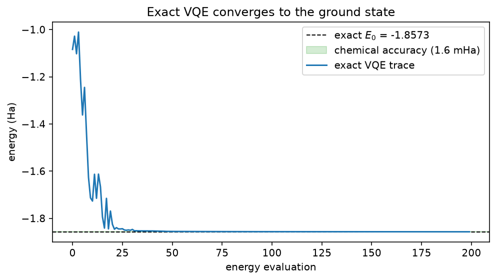
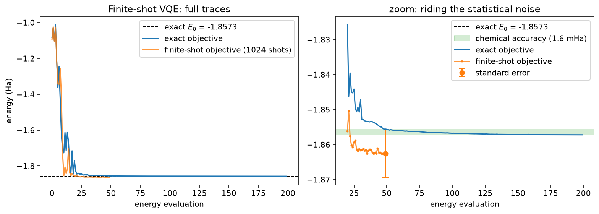

<!-- Generated by docs/mkdocs/tools/convert_tutorials.py. -->

# Find the ground-state energy of H₂ with VQE

<div class="grid cards" markdown>

-   :material-map-marker-path: **Track**

    Algorithms

-   :material-language-python: **Executable source**

    [Download `plot_vqe_h2.py`](../downloads/tutorials/plot_vqe_h2.py)

</div>

The variational quantum eigensolver (VQE) estimates the ground-state
energy of a Hamiltonian $H$ by making the variational principle
$E(\theta) \geq E_0$ do the work: a parameterized circuit prepares
$|\psi(\theta)\rangle$, the energy

$$
E(\theta) = \langle\psi(\theta)|H|\psi(\theta)\rangle
$$

is evaluated on the quantum processor, and a classical optimizer walks
$\theta$ downhill. The lowest energy found is an upper bound on the
true ground-state energy $E_0$.

This tutorial runs the full loop on the smallest interesting chemistry
example: molecular hydrogen in the STO-3G basis, reduced to two qubits by
qubit tapering (the form used in O'Malley et al.,
[arXiv:1512.06860](https://arxiv.org/abs/1512.06860)). The Hamiltonian
is a sum of five Pauli terms,

$$
H = -1.0524\,II + 0.3979\,IZ - 0.3979\,ZI - 0.0113\,ZZ + 0.1809\,XX,
$$

so the energy is a weighted sum of expectation values — exactly what an
Estimator computes against one circuit evaluation.

The tutorial source contains three executable acts:

1. **Exact VQE** — the energy is evaluated exactly from the statevector,
   and COBYLA minimizes it. The convergence curve is compared against the
   exact ground energy, obtained here by dense diagonalization.
2. **Finite-shot VQE** — the same loop, but every expectation is estimated
   from 1024 shots, with the statistical standard error made explicit.
3. **VQE under noise** — a depolarizing noise model is attached to the
   simulator, and the energy floor moves up: a two-line summary of why
   NISQ chemistry is hard.

Everything is seeded and runs in seconds on a laptop CPU.

!!! info "Source-backed tutorial"

    The narrative and executable cells come from the tracked tutorial
    source. Validation-only Sphinx-Gallery spans are not displayed.
    Runtime panels contain checked-in snapshots captured from that same
    source. Run the download directly to reproduce its plots and stdout.

## The Hamiltonian and its exact spectrum

The five Pauli terms are inlined as data. Pauli strings follow the convention *leftmost character =
qubit 0*: `IZ` acts with $Z$ on qubit 1.

The exact ground energy is obtained by dense diagonalization of the
4x4 matrix. It serves two purposes: the reference line on the
convergence plots, and a reminder that the variational principle bounds
the *lowest* eigenvalue — the other three are printed for context.

```python title="Python cell 1"
import matplotlib.pyplot as plt
import numpy as np
from scipy.optimize import minimize

import fatqat as fq
import fatqat.operations as op

H2_TERMS = [
    # (Pauli string, coefficient); leftmost character acts on qubit 0.
    ("II", -1.052373245772859),
    ("IZ", +0.39793742484318045),
    ("ZI", -0.39793742484318045),
    ("ZZ", -0.01128010425623538),
    ("XX", +0.18093119978423156),
]

PAULI = {
    "I": np.eye(2),
    "X": np.array([[0, 1], [1, 0]]),
    "Y": np.array([[0, -1j], [1j, 0]]),
    "Z": np.array([[1, 0], [0, -1]]),
}

# np.kron places the first factor on the high tensor factor, so this matrix
# is big-endian (qubit 0 = high bit) — the opposite of fatqat's statevector
# order. Only its eigenvalues are used below, and those are unaffected by
# the qubit-ordering convention.
H_MATRIX = sum(
    coeff * np.kron(PAULI[pauli[0]], PAULI[pauli[1]]) for pauli, coeff in H2_TERMS
)
eigenvalues = np.linalg.eigvalsh(H_MATRIX)
E0 = eigenvalues[0]
print("exact spectrum:", np.round(eigenvalues, 5))
print(f"ground-state energy E0 = {E0:.5f} Ha")

CHEMICAL_ACCURACY = 1.6e-3  # 1.6 mHa, the conventional accuracy target
```

<!-- tutorial-result-start:cell-1 -->
!!! example "Runtime result"

    ```text
    exact spectrum: [-1.857 -1.245 -0.883 -0.225]
    ground-state energy E0 = -1.85728 Ha
    ```

<!-- tutorial-result-end:cell-1 -->

The identity term has expectation 1 in every state, so it folds into a
constant offset. The optimizer only ever sees the four non-identity
expectations:

```python title="Python cell 2"
OFFSET = H2_TERMS[0][1]  # the II coefficient
COEFFS = np.array([coeff for pauli, coeff in H2_TERMS[1:]])
```

## The Hamiltonian as observables

Each non-identity Pauli term becomes one `fq.Observable`, built with
`from_sparse`: only the non-identity factors are named, as explicit
`(pauli, (qubit,), coefficient)` entries. The explicit qubit index
sidesteps the string-endianness trap noted above (`IZ` means *Z on
qubit 1*). One entry is a product — `("ZZ", (0, 1), 1.0)` is the
single term $Z_0 Z_1$, while two entries would sum. Every
observable carries coefficient 1.0; the Hamiltonian coefficients live
in `COEFFS` and are applied classically, so the energy is `OFFSET`
plus the weighted sum of the four expectations.

```python title="Python cell 3"
NUM_QUBITS = 2
NUM_ROUNDS = 2

OBSERVABLES = [
    fq.Observable.from_sparse([("Z", (1,), 1.0)], num_qubits=NUM_QUBITS),    # IZ
    fq.Observable.from_sparse([("Z", (0,), 1.0)], num_qubits=NUM_QUBITS),    # ZI
    fq.Observable.from_sparse([("ZZ", (0, 1), 1.0)], num_qubits=NUM_QUBITS),
    fq.Observable.from_sparse([("XX", (0, 1), 1.0)], num_qubits=NUM_QUBITS),
]
```

## The ansatz: a parameterized template

`THETA` is a `fq.ParameterVector` of length 4 — a group of named
placeholders. `build_template()` assembles the two-qubit ansatz with
the placeholders in place of angles: two layers, each applying `RY`
on both wires (one parameter each) and closing with `CX` from qubit 0
to qubit 1. The template is built once; binding it returns a new
program and never mutates it.

Because the Hamiltonian is real, its ground state can be chosen real,
and four `RY` angles interleaved with an entangler span every real
two-qubit state — so this ansatz can reach $E_0$ in principle.

```python title="Python cell 4"
THETA = fq.ParameterVector("theta", 4)
def build_template():
    program = fq.Program(NUM_QUBITS)
    for r in range(NUM_ROUNDS):
        for q in range(NUM_QUBITS):
            program.add(op.RY(THETA[r * NUM_QUBITS + q]), q)
        program.add(op.CX, (0, 1))
    return program

template = build_template()
```

The template draws like any other program: two layers of
parameter-bearing `RY` rotations, each closed by the entangler.

```python title="Python cell 5"
figure = template.draw("matplotlib")
figure.set_size_inches(10, 3)
```

## The exact energy function

One energy evaluation binds the template at the current parameters —
`Estimator.run` rejects programs that still contain unbound
parameters — then evaluates all four observables against a single
evolution. With `shots=0`, the Estimator default, the expectations
are exact; the energy is their weighted sum plus the identity offset.

```python title="Python cell 6"
ESTIMATOR_SV = fq.Estimator(fq.simulator.Simulator(method="SV"))


def energy_exact(theta):
    """Exact energy of the ansatz at ``theta``"""
    bound = template.assign_parameters({THETA: theta})
    expectations = ESTIMATOR_SV.run(bound, OBSERVABLES).result().get_expectation()
    return float(OFFSET + COEFFS @ expectations)
```

## Optimization

COBYLA minimizes the black-box energy from a small random start — no
gradients needed. The trace is recorded for the convergence plot.

```python title="Python cell 7"
rng = np.random.default_rng(0)
x0 = rng.uniform(-0.1, 0.1, 4)


def _trace(energy, theta, trace):
    value = energy(theta)
    trace.append(value)
    if len(trace) % 25 == 0:
        print(f"eval {len(trace):4d}  energy {value:.5f}")
    return value


trace_exact = []
result_exact = minimize(
    lambda theta: _trace(energy_exact, theta, trace_exact),
    x0,
    method="COBYLA",
    options={"maxiter": 200, "rhobeg": 0.5},
)
print(f"exact VQE minimum {result_exact.fun:.5f} Ha "
      f"(error {result_exact.fun - E0:+.5f} Ha)")
```

<!-- tutorial-result-start:cell-7 -->
!!! example "Runtime result"

    ```text
    eval   25  energy -1.84524
    eval   50  energy -1.85557
    eval   75  energy -1.85627
    eval  100  energy -1.85675
    eval  125  energy -1.85698
    eval  150  energy -1.85709
    eval  175  energy -1.85720
    eval  200  energy -1.85722
    exact VQE minimum -1.85722 Ha (error +0.00006 Ha)
    ```

<!-- tutorial-result-end:cell-7 -->

```python title="Python cell 8"
fig, ax = plt.subplots(figsize=(7, 4))
ax.axhline(E0, color="k", ls="--", lw=1, label=f"exact $E_0$ = {E0:.4f}")
ax.axhspan(E0, E0 + CHEMICAL_ACCURACY, color="tab:green", alpha=0.2,
           label="chemical accuracy (1.6 mHa)")
ax.plot(trace_exact, label="exact VQE trace")
ax.set_xlabel("energy evaluation")
ax.set_ylabel("energy (Ha)")
ax.set_title("Exact VQE converges to the ground state")
ax.legend()
fig.tight_layout()
```

<!-- tutorial-result-start:cell-8 -->
!!! example "Runtime result"

    

<!-- tutorial-result-end:cell-8 -->

## Finite-shot expectations

The same energy, estimated the way hardware would deliver it: every
expectation comes from 1024 measurement shots. `shots` is a per-run
option, not an estimator property, so the same estimator serves exact
and sampled evaluations. An explicit `simulation_config={"seed": ...}`
reuses the same randomness at every evaluation, keeping the optimizer's
landscape deterministic. `sampled_std` propagates the per-observable
standard errors (`get_std()`) through the weights in quadrature —
$\sigma_E = \sqrt{\sum_i c_i^2 \sigma_i^2}$ — the scale of the
error bar on the noisy objective.

```python title="Python cell 9"
def energy_sampled(theta):
    """Finite-shot energy of the ansatz at ``theta``."""
    bound = template.assign_parameters({THETA: theta})
    expectations = (
        ESTIMATOR_SV.run(
            bound, OBSERVABLES, shots=1024, simulation_config={"seed": 7}
        )
        .result()
        .get_expectation()
    )
    return float(OFFSET + COEFFS @ expectations)


def sampled_std(theta):
    """Standard error of the finite-shot energy."""
    bound = template.assign_parameters({THETA: theta})
    std = (
        ESTIMATOR_SV.run(
            bound, OBSERVABLES, shots=1024, simulation_config={"seed": 7}
        )
        .result()
        .get_std()
    )
    return float(np.sqrt(COEFFS**2 @ std**2))
```

The same COBYLA run, now optimizing the noisy objective. Note that what
matters at the end is the *exact* energy of the point found — the shot
noise only steers the search.

```python title="Python cell 10"
trace_sampled = []
result_sampled = minimize(
    lambda theta: _trace(energy_sampled, theta, trace_sampled),
    x0,
    method="COBYLA",
    options={"maxiter": 200, "rhobeg": 0.5},
)
final_exact = energy_exact(result_sampled.x)
final_std = sampled_std(result_sampled.x)
print(f"finite-shot VQE stopped at {result_sampled.fun:.5f} ± {final_std:.5f} Ha")
print(f"exact energy at that point: {final_exact:.5f} Ha "
      f"(error {final_exact - E0:+.5f} Ha)")
```

<!-- tutorial-result-start:cell-10 -->
!!! example "Runtime result"

    ```text
    eval   25  energy -1.86072
    eval   50  energy -1.86258
    finite-shot VQE stopped at -1.86258 ± 0.00676 Ha
    exact energy at that point: -1.85536 Ha (error +0.00191 Ha)
    ```

<!-- tutorial-result-end:cell-10 -->

```python title="Python cell 11"
fig, (ax, ax_zoom) = plt.subplots(1, 2, figsize=(11, 4))
ax.axhline(E0, color="k", ls="--", lw=1, label=f"exact $E_0$ = {E0:.4f}")
ax.plot(trace_exact, label="exact objective")
ax.plot(trace_sampled, alpha=0.8, label="finite-shot objective (1024 shots)")
ax.set_xlabel("energy evaluation")
ax.set_ylabel("energy (Ha)")
ax.set_title("Finite-shot VQE: full traces")
ax.legend()

cut = 20  # skip the initial transient
ax_zoom.axhline(E0, color="k", ls="--", lw=1, label=f"exact $E_0$ = {E0:.4f}")
ax_zoom.axhspan(E0, E0 + CHEMICAL_ACCURACY, color="tab:green", alpha=0.2,
                label="chemical accuracy (1.6 mHa)")
ax_zoom.plot(range(cut, len(trace_exact)), trace_exact[cut:],
             label="exact objective")
ax_zoom.plot(range(cut, len(trace_sampled)), trace_sampled[cut:],
             alpha=0.8, marker=".", ms=4, label="finite-shot objective")
ax_zoom.errorbar(
    len(trace_sampled) - 1,
    trace_sampled[-1],
    yerr=final_std,
    fmt="o",
    color="tab:orange",
    capsize=4,
    label="standard error",
)
ax_zoom.set_xlabel("energy evaluation")
ax_zoom.set_title("zoom: riding the statistical noise")
ax_zoom.legend()
fig.tight_layout()
```

<!-- tutorial-result-start:cell-11 -->
!!! example "Runtime result"

    

<!-- tutorial-result-end:cell-11 -->

## A depolarizing noise model

Noise is declared independently of the program: a `fq.NoiseModel`
holds physical declarations — here `fq.noise.Depolarizing` after every
`RY` ($p = 0.01$) and, more strongly, after every `CX`
($p = 0.05$) — and the same template runs on a density-matrix
simulator constructed with that model. A density-matrix Estimator in
`shots=0` mode returns the noise-averaged expectation exactly: no
sampling is needed to *see* the noise. See
[ideal and noisy execution](../guide/ideal-and-noisy.md) for the full workflow.

```python title="Python cell 12"
noise = fq.NoiseModel()
noise.add(fq.noise.Depolarizing(p=0.01), operation=op.RY)
noise.add(fq.noise.Depolarizing(p=0.05), operation=op.CX)
ESTIMATOR_NOISY = fq.Estimator(fq.simulator.Simulator(method="DM", noise=noise))


def energy_noisy(theta):
    """Noise-averaged energy of the ansatz at ``theta``."""
    bound = template.assign_parameters({THETA: theta})
    expectations = ESTIMATOR_NOISY.run(bound, OBSERVABLES).result().get_expectation()
    return float(OFFSET + COEFFS @ expectations)
```

First, the degradation: the exact-VQE minimum is re-evaluated under
noise. Then COBYLA re-optimizes under noise — and recovers essentially
nothing: a variational ansatz cannot rotate unital noise away, so the
lifted floor is there to stay (it can only be mitigated classically,
not optimized away).

```python title="Python cell 13"
degraded = energy_noisy(result_exact.x)
print(f"noiseless minimum under noise: {degraded:.5f} Ha "
      f"(shift {degraded - result_exact.fun:+.5f} Ha)")

trace_noisy = []
result_noisy = minimize(
    lambda theta: _trace(energy_noisy, theta, trace_noisy),
    x0,
    method="COBYLA",
    options={"maxiter": 200, "rhobeg": 0.5},
)
print(f"noisy VQE minimum {result_noisy.fun:.5f} Ha "
      f"(error vs. E0 {result_noisy.fun - E0:+.5f} Ha)")
```

<!-- tutorial-result-start:cell-13 -->
!!! example "Runtime result"

    ```text
    noiseless minimum under noise: -1.75766 Ha (shift +0.09955 Ha)
    eval   25  energy -1.74691
    eval   50  energy -1.75500
    eval   75  energy -1.75601
    eval  100  energy -1.75696
    eval  125  energy -1.75709
    eval  150  energy -1.75716
    eval  175  energy -1.75719
    eval  200  energy -1.75721
    noisy VQE minimum -1.75721 Ha (error vs. E0 +0.10006 Ha)
    ```

<!-- tutorial-result-end:cell-13 -->

```python title="Python cell 14"
fig, ax = plt.subplots(figsize=(7, 4))
ax.axhline(E0, color="k", ls="--", lw=1, label=f"exact $E_0$ = {E0:.4f}")
ax.plot(trace_exact, label="noiseless objective")
ax.plot(trace_noisy, label="noisy objective (depolarizing)")
ax.axhline(result_noisy.fun, color="tab:orange", ls=":", lw=1,
           label=f"noisy floor = {result_noisy.fun:.4f}")
ax.set_xlabel("energy evaluation")
ax.set_ylabel("energy (Ha)")
ax.set_title("Noise lifts the variational floor")
ax.legend()
fig.tight_layout()
```

<!-- tutorial-result-start:cell-14 -->
!!! example "Runtime result"

    

<!-- tutorial-result-end:cell-14 -->

## Where to go from here

* Bigger molecules need a chemistry package to produce the Pauli sum and
  a physically motivated ansatz (e.g. UCCSD) instead of the
  hardware-efficient one used here.
* On larger systems, the bitstrings sampled from the optimized state can
  be post-processed classically (sample-based quantum diagonalization) —
  overkill at two qubits, where the sampled subspace is the whole space.
