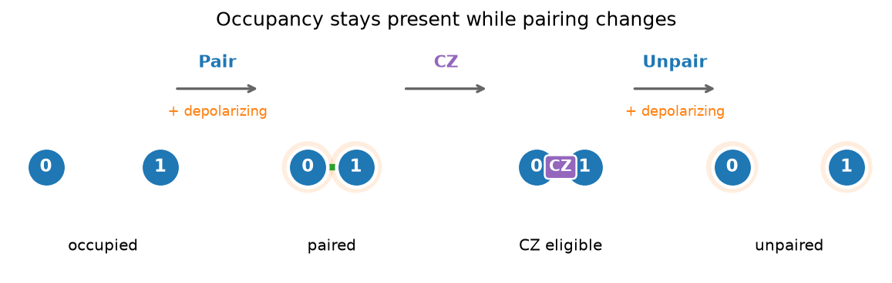

# 在硬件配置上测试 Program

硬件配置模拟器会检查一个 Program 能否按原样在所选设备形状上运行。与通用
[`Simulator`][fatqat.simulator.Simulator] 一样，它在线路层次演化离散门；
此外还会强制执行原生操作集合、布局、连通性、容量，以及原子阵列的占用规则。

因此，在尚不需要物理哈密顿量模型时，硬件配置很有价值。它同时划出一条重要
边界：配置会校验你的选择，但不会替你做出选择。

## 从逻辑行为开始

先用通用模拟器确定 Program 的含义。贝尔 Program 使用方便的逻辑门，此时
还没有设备布局：

```pycon
>>> import numpy as np
>>> import fatqat as fq
>>> import fatqat.operations as ops
>>> bell = fq.Program(2, 2)
>>> bell.add(ops.H, 0)
>>> bell.add(ops.CX, (0, 1))
>>> bell.measure_all()
>>> counts = fq.simulator.Simulator(runtime="numpy").run(
...     bell,
...     shots=16,
...     simulation_config={"seed": 7},
... ).result().get_counts()
>>> sum(counts.values())
16
>>> set(counts) <= {"00", "11"}
True
```

现在让 Google 风格的超导硬件配置检查同一个 Program。配置可以直接报告自己
是否支持 `H`，因此无需把门表复制到应用代码：

```pycon
>>> profile = fq.simulator.SCQubitGoogleSimulator(
...     grid_size=(2, 3),
...     runtime="numpy",
... )
>>> profile.implementation_map.supports(ops.H)
False
```

因此，提交 `bell` 会引发
[`UnsupportedOperationError`][fatqat.errors.UnsupportedOperationError]。FatQat
不会悄悄把 `H` 或 `CX` 分解成该配置的原生操作。

## 明确指定布局

原生操作只是问题的一半。在这个 2 x 3 配置中，整数设备标签按行排列：

```text
0 --- 1 --- 2
|     |     |
3 --- 4 --- 5
```

下一个 Program 完全由原生操作组成，但把它的两个量子比特放在 `0` 和 `4`
上，会请求网格并不提供的对角 `CZ`：

```pycon
>>> qubits = fq.QuantumRegister(2, name="q")
>>> native = fq.Program([qubits])
>>> native.add(ops.RX(np.pi), qubits[0])
>>> native.add(ops.RX(np.pi), qubits[1])
>>> native.add(ops.CZ, (qubits[0], qubits[1]))
>>> bad_layout = fq.ResourceLayout({qubits[0]: 0, qubits[1]: 4})
>>> try:
...     profile.run(native, resource_layout=bad_layout)
... except fq.errors.UnsupportedOperationError as error:
...     print(error)
CZGate is not supported on device operands (0, 4)
```

把第二个程序量子比特移到相邻的设备标签 `1`；Program 本身无需改变：

```pycon
>>> layout = fq.ResourceLayout({qubits[0]: 0, qubits[1]: 1})
>>> state = profile.run(native, resource_layout=layout).result().get_statevector()
>>> state.shape
(4,)
>>> int(np.argmax(np.abs(state) ** 2))
3
```

这证明门集合和布局均有效。保真度、时序与脉冲动力学则需要物理仿真器。

## 主动加入参考噪声

如果没有传入噪声模型，超导硬件配置就是理想的。随包提供的模型适合作为比较
基线，但并不代表当前硬件特性：

```python
profile_type = fq.simulator.SCQubitGoogleSimulator
noisy_profile = profile_type(
    grid_size=(2, 3),
    runtime="numpy",
    noise=profile_type.default_noise_model(),
)

measured_native = fq.Program(2, 2)
measured_native.add(ops.RX(np.pi), 0)
measured_native.add(ops.RX(np.pi), 1)
measured_native.add(ops.CZ, (0, 1))
measured_native.measure_all()
noisy_counts = noisy_profile.run(
    measured_native,
    shots=100,
    simulation_config={"seed": 7},
).result().get_counts()
```

让噪声保持主动启用，比较过程会更清晰：先验证与目标兼容，再决定参考误差模型
能否回答你的问题。`AtomArraySimulator` 不附带参考噪声模型；如果加载、损失
或其他效应属于实验的一部分，请传入你自己的 [`NoiseModel`][fatqat.NoiseModel]。

[`SCQubitIBMSimulator`][fatqat.simulator.SCQubitIBMSimulator] 采用同样的工作流，
但使用不同的原生门族。先检查所选配置的实现映射，再按其要求选择 Program 和
布局。

## 追踪原子占用与配对

原子阵列配置提出的是另一类硬件问题。它没有固定几何结构；相反，`Put` 建立
占用，`Pair`/`Unpair` 改变允许执行 `CZ` 的连通关系：



??? example "复现此图"

    ```python
    import matplotlib.pyplot as plt

    stage_centers = (0.8, 2.8, 4.8, 6.8)
    separations = (1.00, 0.42, 0.42, 1.00)
    stage_labels = ("occupied", "paired", "CZ eligible", "unpaired")

    fig, ax = plt.subplots(figsize=(7.6, 2.35))

    def draw_atoms(center, separation, *, connected=False, gate=False, noisy=False):
        positions = (center - separation / 2.0, center + separation / 2.0)
        if noisy:
            ax.scatter(
                positions,
                (0.0, 0.0),
                s=1050,
                color="C1",
                alpha=0.13,
                edgecolor="none",
                zorder=1,
            )
        if connected:
            ax.plot(
                positions,
                (0.0, 0.0),
                color="C2" if not gate else "C4",
                linewidth=4.0,
                solid_capstyle="round",
                zorder=2,
            )
        ax.scatter(
            positions,
            (0.0, 0.0),
            s=610,
            facecolor="C0",
            edgecolor="white",
            linewidth=2.2,
            zorder=3,
        )
        for atom, position in enumerate(positions):
            ax.text(
                position,
                0.0,
                str(atom),
                color="white",
                ha="center",
                va="center",
                fontsize=11,
                fontweight="bold",
                zorder=4,
            )
        if gate:
            ax.text(
                center,
                0.0,
                "CZ",
                color="white",
                ha="center",
                va="center",
                fontsize=9.5,
                fontweight="bold",
                bbox={
                    "boxstyle": "round,pad=0.28",
                    "facecolor": "C4",
                    "edgecolor": "white",
                    "linewidth": 1.2,
                },
                zorder=5,
            )

    draw_atoms(stage_centers[0], separations[0])
    draw_atoms(stage_centers[1], separations[1], connected=True, noisy=True)
    draw_atoms(stage_centers[2], separations[2], connected=True, gate=True)
    draw_atoms(stage_centers[3], separations[3], noisy=True)

    transitions = (
        (stage_centers[0], stage_centers[1], "Pair", True),
        (stage_centers[1], stage_centers[2], "CZ", False),
        (stage_centers[2], stage_centers[3], "Unpair", True),
    )
    for start, end, label, noisy in transitions:
        ax.annotate(
            "",
            xy=(end - 0.62, 0.72),
            xytext=(start + 0.62, 0.72),
            arrowprops={"arrowstyle": "->", "color": "0.40", "linewidth": 1.6},
        )
        midpoint = (start + end) / 2.0
        ax.text(
            midpoint,
            0.88,
            label,
            ha="center",
            va="bottom",
            fontsize=10.5,
            fontweight="bold",
            color="C0" if label != "CZ" else "C4",
        )
        if noisy:
            ax.text(
                midpoint,
                0.57,
                "+ depolarizing",
                ha="center",
                va="top",
                fontsize=8.5,
                color="C1",
            )

    for center, label in zip(stage_centers, stage_labels):
        ax.text(center, -0.66, label, ha="center", va="top", fontsize=9.5)

    ax.set_title("Occupancy stays present while pairing changes", fontsize=12, pad=4)
    ax.set(xlim=(0.0, 7.6), ylim=(-0.96, 1.24))
    ax.axis("off")
    fig.tight_layout(pad=0.3)
    ```

距离变化只是配对意图的示意图，而不是模拟得到的轨迹。`AtomArraySimulator`
不会记录坐标或移动持续时间；`Pair` 声明两个已占用位置可以执行原生 `CZ`，
`Unpair` 则取消这一资格。

```pycon
>>> atoms = fq.Program(2, 2)
>>> atoms.add(ops.Put, (0, 1))
>>> atoms.add(ops.Pair, (0, 1))
>>> atoms.add(ops.RX(np.pi), 0)
>>> atoms.add(ops.CZ, (0, 1))
>>> atoms.add(ops.Unpair, (0, 1))
>>> atoms.measure_all()
>>> atom_counts = fq.simulator.AtomArraySimulator(num_sites=2).run(
...     atoms,
...     shots=8,
...     simulation_config={"seed": 7},
... ).result().get_counts()
>>> atom_counts
{'01': 8}
```

除非附加噪声假设，否则配对是理想过程。例如，每当任一移动指令发生时，可对
每个原子独立施加一个较小的退极化通道：

```pycon
>>> movement_noise = fq.NoiseModel()
>>> for movement in (ops.Pair, ops.Unpair):
...     for target_position in (0, 1):
...         movement_noise.add(
...             fq.noise.Depolarizing(p=0.02),
...             operation=movement,
...             target_positions=target_position,
...         )
>>> noisy_atom_backend = fq.simulator.AtomArraySimulator(
...     num_sites=2,
...     noise=movement_noise,
... )
>>> noisy_counts = noisy_atom_backend.run(
...     atoms,
...     shots=100,
...     simulation_config={"seed": 7},
... ).result().get_counts()
>>> sum(noisy_counts.values())
100
```

该通道会在 `Pair` 和 `Unpair` 期间扰动量子态，但不会移除任一原子。如果
移动应改变占用，请改用 [`Loss`][fatqat.noise.Loss]。

省略 `Pair` 而直接执行 `CZ` 是 Program 错误；FatQat 不会自动运输或配对原子。
缺失原子则是另一种情况：空位置会报告擦除数字 `2`，而受支持的门只是没有
原子可供作用。

原生集合、容量和方法支持请查阅[硬件配置 API](../api/simulators/index.md)。当
脉冲持续时间、物理能级、漂移或连续时间噪声变得重要时，请继续学习
[哈密顿量仿真](hamiltonian-emulation.md)。
