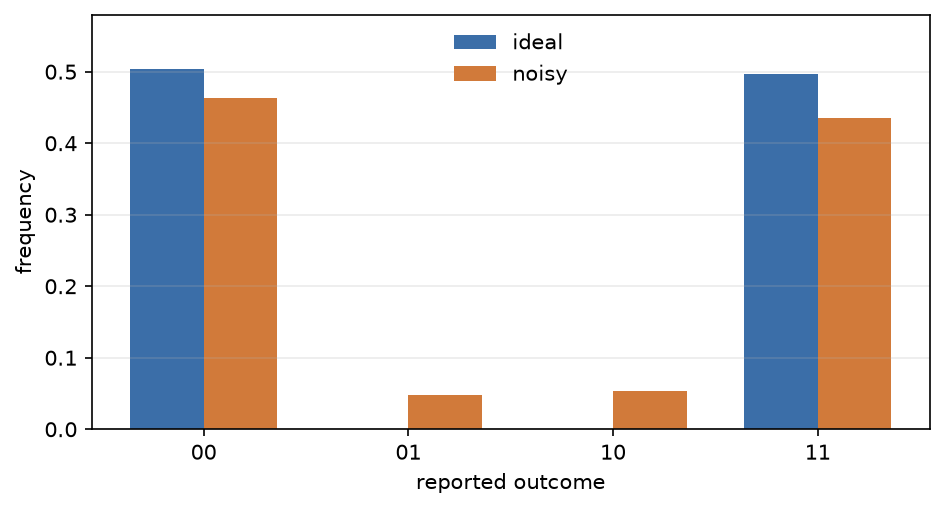

# 在理想与含噪条件下比较同一 Program

先进行理想运行，然后只改变执行模型。[`NoiseModel`][fatqat.NoiseModel] 描述
误差及其作用位置，后端则决定如何实现它们。[`Program`][fatqat.Program] 保持
不变，因此两次运行之间的差异有明确的原因。这里，一个被测量的贝尔 Program
同时受到操作噪声和读出混淆的影响。

## 建立理想基线

先构建计算，再配置理想与含噪后端：

```pycon
>>> import numpy as np
>>> import fatqat as fq
>>> import fatqat.operations as ops
>>> bell = fq.Program(2, 2)
>>> bell.add(ops.H, 0)
>>> bell.add(ops.CX, (0, 1))
>>> bell.measure_all()
>>> ideal_backend = fq.simulator.Simulator(
...     method="density_matrix",
...     runtime="numpy",
... )
>>> ideal_counts = ideal_backend.run(
...     bell,
...     shots=4_000,
...     simulation_config={"seed": 7},
... ).result().get_counts()
>>> ideal_counts.get("01", 0) + ideal_counts.get("10", 0)
0
```

理想的贝尔运行不会产生错误宇称结果：两个经典数字始终相同。`00` 与 `11`
之间的计数仍会波动，因为测量采用随机采样。

## 改变执行方式，而不是 Program

在 `CX` 之后加入一个有限通道，在测量时加入经典混淆，然后构建另一个后端：

```pycon
>>> noise = fq.NoiseModel()
>>> noise.add(
...     fq.noise.Depolarizing(p=0.12),
...     operation=ops.CX,
... )
>>> noise.add(
...     fq.noise.ReadoutConfusion(
...         [[0.98, 0.04], [0.02, 0.96]]
...     )
... )
>>> noisy_backend = fq.simulator.Simulator(
...     method="density_matrix",
...     runtime="numpy",
...     noise=noise,
... )
>>> noisy_counts = noisy_backend.run(
...     bell,
...     shots=4_000,
...     simulation_config={"seed": 7},
... ).result().get_counts()
>>> noisy_errors = noisy_counts.get("01", 0) + noisy_counts.get("10", 0)
>>> noisy_errors > 0
True
>>> sum(noisy_counts.values())
4000
```

退极化通道会在纠缠门后改变量子态。混淆矩阵只改变报告出的经典数字：在本例
中，真实的 `0` 有百分之二的概率被报告为 `1`，真实的 `1` 则有百分之四的
概率被报告为 `0`。两种效应都可能产生下图中的错误宇称柱。



??? example "复现此图"

    ```python
    import numpy as np
    import matplotlib.pyplot as plt
    import fatqat as fq
    import fatqat.operations as ops

    bell = fq.Program(2, 2)
    bell.add(ops.H, 0)
    bell.add(ops.CX, (0, 1))
    bell.measure_all()

    noise = fq.NoiseModel()
    noise.add(fq.noise.Depolarizing(p=0.12), operation=ops.CX)
    noise.add(
        fq.noise.ReadoutConfusion(
            [[0.98, 0.04], [0.02, 0.96]]
        )
    )

    ideal_backend = fq.simulator.Simulator(
        method="density_matrix", runtime="numpy"
    )
    noisy_backend = fq.simulator.Simulator(
        method="density_matrix", runtime="numpy", noise=noise
    )
    shots = 4_000
    run_options = {"shots": shots, "simulation_config": {"seed": 7}}
    ideal = ideal_backend.run(bell, **run_options).result().get_counts()
    noisy = noisy_backend.run(bell, **run_options).result().get_counts()

    labels = ["00", "01", "10", "11"]
    ideal_frequency = np.array([ideal.get(label, 0) for label in labels]) / shots
    noisy_frequency = np.array([noisy.get(label, 0) for label in labels]) / shots

    assert ideal.get("01", 0) + ideal.get("10", 0) == 0
    assert noisy.get("01", 0) + noisy.get("10", 0) > 0

    x = np.arange(len(labels))
    width = 0.36
    fig, ax = plt.subplots(figsize=(6.4, 3.5))
    ax.bar(
        x - width / 2,
        ideal_frequency,
        width,
        label="ideal",
        color="#3b6ea8",
    )
    ax.bar(
        x + width / 2,
        noisy_frequency,
        width,
        label="noisy",
        color="#d17a3a",
    )
    ax.set(
        xlabel="reported outcome",
        ylabel="frequency",
        xticks=x,
        xticklabels=labels,
        ylim=(0.0, 0.58),
    )
    ax.legend(frameon=False)
    ax.grid(axis="y", alpha=0.25)
    fig.tight_layout()
    ```

这项比较是受控的，因为两个后端接收同一个 `bell` 对象、相同采样次数和相同
随机种子。只有执行模型发生变化。

## 密度矩阵与采样轨迹

密度矩阵方法会在测量前将支持的有限通道作为精确混态演化应用。计数仍然采用
采样，因为它描述的是各次报告结果。

随机噪声到达 Program 时，状态向量后端会改为采样一条通道轨迹。这样可以减少
状态存储量，但每次采样表示一个分支，而不是精确系综。当答案是精确含噪状态或
期望值时，请使用密度矩阵；当研究目的本来就包括分支采样时，请使用状态向量
轨迹。两种方法应在重复测量结果的统计意义上相符，而不是逐次采样完全一致。

## 线路通道与连续噪声

| 执行层次 | 噪声描述 | 作用位置 |
| --- | --- | --- |
| 线路模拟器 | 有限概率与通道 | 匹配的操作边界处 |
| 物理仿真器 | 速率与弛豫时间 | 整个已用的哈密顿量/Lindblad 演化期间 |

FatQat 不会凭空设定门时长来转换两者。若要研究脉冲持续时间、空闲演化、泄漏或
连续时间噪声，请转到[哈密顿量级仿真](hamiltonian-emulation.md)。支持的组合、
选择器和校验规则请参阅[噪声后端支持](../api/noise/backend-support.md#noise-backend-support)
表和[噪声模型 API](../api/noise/model.md)。
