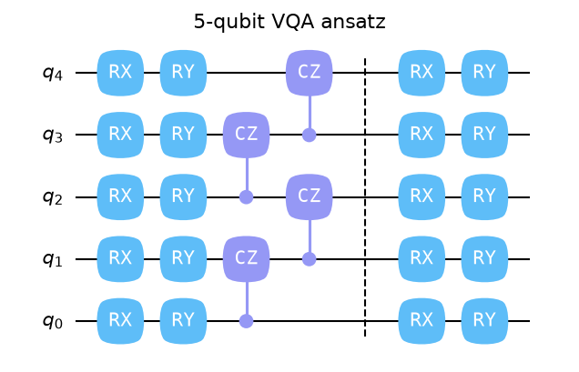
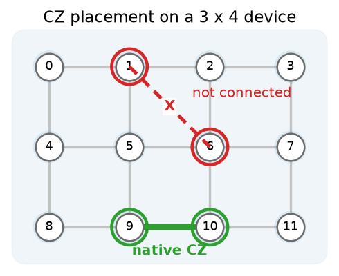

# 用户指南

请选择能够回答当前问题的细节层次。每条路径都从同一个、与后端无关的
[`Program`][fatqat.Program] 出发，因此从算法研究转向硬件或物理研究时，
无需采用第二套编程模型。

-   { loading=lazy width="636" height="409" }

    :material-chart-bell-curve-cumulative: **探索算法**

    从理想线路行为开始，检查状态与测量结果，再加入可控噪声并评估性能。

    [从模拟开始 :material-arrow-right:](simulation.md)

-   { loading=lazy width="490" height="400" }

    :material-chip: **检验硬件约束**

    在不改变逻辑工作负载的情况下，加入拓扑、原生操作、布局、占用、移动和
    参考噪声。

    [打开硬件配置模拟 :material-arrow-right:](hardware-profile-simulation.md)

-   { loading=lazy width="639" height="418" }

    :material-atom: **追踪物理过程**

    将已校准的门和直接脉冲控制解析为 Transmon 与中性原子的连续动力学。

    [打开哈密顿量仿真 :material-arrow-right:](hamiltonian-emulation.md)

## 一个 Program，三个层次

| 问题 | 执行目标 | 典型答案 |
| --- | --- | --- |
| 算法会产生什么结果？ | 通用模拟器 | 计数、状态、期望值或酉矩阵 |
| 它是否符合这一设备配置？ | 硬件配置模拟器 | 原生操作、布局和噪声行为 |
| 哪些动力学产生了这些结果？ | 哈密顿量仿真器 | 时间演化、泄漏、占用和脉冲效应 |

## 从一个可运行的程序开始

第一次使用 FatQat？请[构建并运行一个贝尔程序](quickstart.md)。整个过程大约
需要十分钟，最终会得到线路图和计数图。

准备好超越第一个线路后，请[编写功能更丰富的 Program](program.md)。该章节
介绍具名寄存器、经典控制、可复用参数和混合量子比特—量子三能级系统，同时
保持同一套编程模型。

!!! tip "提示"

    本指南讲解完整工作流及其背后的思路。需要准确的签名或契约时，请进入
    [API 参考](../api/index.md)。[教程](../tutorials/index.md)则是在相同功能
    基础上构建的较长案例研究。
