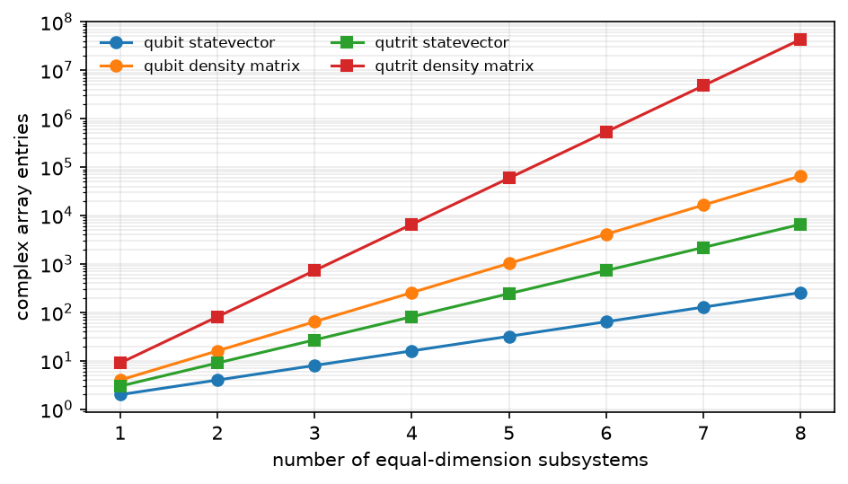

# 性能与扩展

在调优运行时之前，先估算 FatQat 需要承载多大的状态。子系统维数和所选表示
方式通常比切换运行时更早成为限制因素。

首先选择包含所需效应的最简执行层次；[选择物理建模的细致程度](execution-models.md)
划定了这条边界。然后在你自己的 [`Program`][fatqat.Program] 上使用下面的估算
方法和基准测试模式。

## 运行前先计算状态空间

如果局域维数为 `d0, d1, ...`，状态空间维数就是它们的乘积。这既体现了
FatQat 对混合维数 Program 的支持，也明确展示了其扩展规律：

```pycon
>>> import math
>>> local_dimensions = (2, 2, 2, 2, 3, 3)  # four qubits and two qutrits
>>> dimension = math.prod(local_dimensions)
>>> dimension
144
>>> dimension**2
20736
```

状态向量为每个基态存储一个复数条目。密度矩阵或酉矩阵存储方阵，而超算符
在已经平方的密度矩阵空间中又是方阵。若总维数为 `D`，四者的条目数量分别
按 `D`、`D**2`、`D**2` 和 `D**4` 扩展。临时工作空间和后端开销还会
增加这些底层数量。

状态规模会随子系统数量和局域维数同时呈指数增长：



??? example "复现此图"

    ```python
    import numpy as np
    import matplotlib.pyplot as plt

    subsystems = np.arange(1, 9)
    qubit_state = 2 ** subsystems
    qutrit_state = 3 ** subsystems
    qubit_density = qubit_state ** 2
    qutrit_density = qutrit_state ** 2

    assert np.all(np.diff(qubit_state) > 0)
    assert np.all(np.diff(qutrit_density) > 0)

    fig, ax = plt.subplots(figsize=(6.4, 3.7))
    ax.semilogy(
        subsystems,
        qubit_state,
        marker="o",
        label="qubit statevector",
    )
    ax.semilogy(
        subsystems,
        qubit_density,
        marker="o",
        label="qubit density matrix",
    )
    ax.semilogy(
        subsystems,
        qutrit_state,
        marker="s",
        label="qutrit statevector",
    )
    ax.semilogy(
        subsystems,
        qutrit_density,
        marker="s",
        label="qutrit density matrix",
    )
    ax.set(
        xlabel="number of equal-dimension subsystems",
        ylabel="complex array entries",
        xticks=subsystems,
    )
    ax.grid(alpha=0.25, which="both")
    ax.legend(frameon=False, ncols=2, fontsize="small")
    fig.tight_layout()
    ```

此图统计的是条目数而非字节数，因此不假设数据类型或分配器。请估算实际准备
运行的 Program，也要计入仿真器建模的物理能级——即使逻辑 Program 只寻址
量子比特。

## 只请求所需答案

结果的选择可能主导扩展成本。完整酉矩阵或超算符要求计算对每个输入的作用，
而状态运行只要求一个输入状态。同样，如果只需要计数或少数几个期望值，就没有
必要请求完整状态。

采样成本也取决于 Program。确定性演化且只在末尾测量的线路，比包含线路中途
测量、重置、前馈或随机轨迹的线路更能复用计算。不要只根据 `shots` 估算采样
成本；请对实践中将使用的同一个 Program 和结果请求进行基准测试。

如何选择答案请参阅[解读一次运行](interpret-results.md)，准确的方法和结果约束
请参阅 [Simulator API](../api/simulator.md)。

## 在自己的工作负载上比较 NumPy 与 Numba

FatQat 的通用模拟器提供两种 CPU 运行时：

- NumPy 直接执行，避免 JIT 编译的启动开销。
- Numba 首次使用时编译数值内核，之后的调用可以复用兼容的已编译工作。

两种选择都不会改变 Program 或建模的数学内容。编译、数组库行为、CPU、
操作系统、Program 形状和重复次数都会影响结果，因此应进行基准测试，而不要
假定某一种运行时总是更好。FatQat 目前不提供 GPU 运行时。

下面的测试框架把一次不计时的预热与多次测量分开，并比较完全相同的最终状态：

```python
import statistics
import time

import numpy as np
import fatqat as fq
import fatqat.operations as ops

program = fq.Program(8)
for _ in range(6):
    for target in range(8):
        program.add(ops.RY(0.17), target)
    for control in range(7):
        program.add(ops.CX, (control, control + 1))

result_config = {"counts": False, "final_state": True}
numpy_backend = fq.simulator.Simulator("SV", runtime="numpy")
numba_backend = fq.simulator.Simulator("SV", runtime="numba")

def warm_and_measure(backend, repeats=7):
    # Keep compilation and other first-use setup outside steady-state samples.
    backend.run(program, result_config=result_config).result()
    samples = []
    for _ in range(repeats):
        start = time.perf_counter()
        backend.run(program, result_config=result_config).result()
        samples.append(time.perf_counter() - start)
    return statistics.median(samples)

numpy_state = numpy_backend.run(program, result_config=result_config).result()
numba_state = numba_backend.run(program, result_config=result_config).result()
assert np.allclose(
    numpy_state.get_statevector(),
    numba_state.get_statevector(),
)

numpy_seconds = warm_and_measure(numpy_backend)
numba_seconds = warm_and_measure(numba_backend)
print({"numpy": numpy_seconds, "numba": numba_seconds})
```

请把打印出的数值视为本机证据，而不是软件包保证。如果启动延迟很重要，请单独
测量第一次运行，而不要丢弃它。如果持续吞吐量很重要，请增加重复次数和 Program
规模，使其与预期工作负载相符。

## 测量后再调优并行与融合

自动执行设置是合适的基线。手动采样并行、内核并行、工作进程限制和操作融合
只适用于兼容的工作负载，而且额外开销可能超过节省的数值计算。

调优时：

1. 固定 Program、方法、运行时、随机种子和结果请求。
2. 测量稳态性能前，先预热所有需要编译的路径。
3. 重复测量多次，并报告中位数等稳健统计量。
4. 每次只改变一项执行选择。
5. 接受计时结果前，验证所得状态、计数分布或可观测量。
6. 在真正重要的问题规模上重复测试；小例子对不同选择的排序可能与目标工作
   负载不同。

符合条件的组合及其错误行为请参阅
[Simulator 运行时与执行](../api/simulator.md)。融合需要主动启用；当 Program
无法使用显式并行模式时，后端可以拒绝该模式。

## 单独核算物理仿真

哈密顿量仿真器还会产生线路级数组大小估算未涵盖的成本：模型的物理能级、
未被寻址但仍建模的子系统、含时控制、调度、积分区间和开放系统演化。因此，
一个逻辑量子比特在 Transmon 或三能级原子模型中可能占据三个物理能级。

请对实际的模型、排列、控制、持续时间、求解器设置和结果请求进行基准测试。
不要根据门级 Simulator 的计时来外推仿真器运行时间。
[仿真器 API](../api/emulators/index.md)列出了各物理模型可用的求解器与调度控制。
