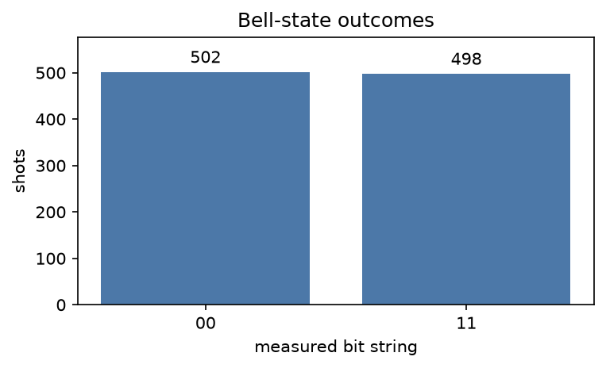

# 构建、绘制并运行一个 Program

大约十分钟内，你将创建一个贝尔对、绘制其线路、运行 1,000 次采样，并看到
为何只会出现 `00` 和 `11`。从开始到结束，这项计算都保存在一个
[`Program`][fatqat.Program] 中。

## 从源代码安装 FatQat

FatQat 尚未发布到 PyPI。请克隆仓库、创建隔离环境并安装检出的代码：

```bash
git clone https://github.com/BoxiLi/fatqat.git
cd fatqat
python -m venv .venv
```

使用适合你所在平台的命令激活环境：

```bash
# macOS or Linux
source .venv/bin/activate

# Windows PowerShell
.venv\Scripts\Activate.ps1
```

然后安装 FatQat：

```bash
python -m pip install --upgrade pip
python -m pip install .
```

## 编写贝尔态 Program

`Program` 按执行顺序记录逻辑资源和指令。下面的程序将两个量子比特制备成
贝尔态，并测量二者：

```pycon
>>> import fatqat as fq
>>> import fatqat.operations as ops
>>> program = fq.Program(2, 2)
>>> program.add(ops.H, 0)
>>> program.add(ops.CX, (0, 1))
>>> program.measure_all()
```

`Program(2, 2)` 创建两个量子比特和两个经典比特。`H` 将量子比特 0 置于
叠加态，`CX` 以量子比特 0 为控制位、量子比特 1 为目标位。最后一条指令把
两个量子测量结果写入经典比特。

Program 描述的是*应当发生什么*。此时它尚未选择模拟器，也没有执行任何演化。

## 检查 Program

绘图是 Program 的原生功能，建立在 QuTiP-QIP 的线路绘图工具之上。FatQat
会把 Program 指令转换给该渲染器。默认渲染器返回一个可显示或保存的
Matplotlib 图形：

```pycon
>>> figure = program.draw()
>>> len(figure.axes)
1
```


??? example "复现此图"

    ```python
    import matplotlib.pyplot as plt
    import fatqat as fq
    import fatqat.operations as ops

    program = fq.Program(2, 2)
    program.add(ops.H, 0)
    program.add(ops.CX, (0, 1))
    program.measure_all()
    fig, ax = plt.subplots(figsize=(8, 3))
    program.draw(ax=ax)
    fig.tight_layout()
    ```

若需适合终端查看的版本，`program.draw("text")` 会返回字符串，而不是直接
打印。绘图只是已记录指令结构的一种视图；它不会运行 Program。

## 运行程序

通用模拟器遵循 Program 的逻辑线路演化。`run()` 提交 Program 并返回一个
[`job`][fatqat.Job]。调用 `job.result()` 会等待任务完成，并给出包含所请求
输出的 [`Result`][fatqat.Result]：

```pycon
>>> backend = fq.simulator.Simulator()
>>> job = backend.run(
...     program,
...     shots=1000,
...     simulation_config={"seed": 7},
... )
>>> result = job.result()
>>> counts = result.get_counts()
>>> sorted(counts)
['00', '11']
>>> sum(counts.values())
1000
```

每次采样最终都会得到 `00` 或 `11`：两个测量比特一致，是因为两个量子比特
发生了纠缠。二者的计数大致相等而非完全相等，因为测量是对状态进行随机采样。
固定随机种子可使这次特定运行得到可复现的结果。



??? example "复现此图"

    ```python
    import matplotlib.pyplot as plt
    import fatqat as fq
    import fatqat.operations as ops

    program = fq.Program(2, 2)
    program.add(ops.H, 0)
    program.add(ops.CX, (0, 1))
    program.measure_all()

    counts = (
        fq.simulator.Simulator()
        .run(program, shots=1000, simulation_config={"seed": 7})
        .result()
        .get_counts()
    )
    assert sorted(counts) == ["00", "11"]
    assert sum(counts.values()) == 1000

    outcomes = sorted(counts)
    fig, ax = plt.subplots(figsize=(5.2, 3.2))
    bars = ax.bar(
        outcomes,
        [counts[outcome] for outcome in outcomes],
        color="#4c78a8",
    )
    ax.bar_label(bars, padding=3)
    ax.set(
        xlabel="measured bit string",
        ylabel="shots",
        title="Bell-state outcomes",
    )
    ax.set_ylim(0, max(counts.values()) * 1.15)
    fig.tight_layout()
    ```

请保留这个 `Program`：接下来的章节会更换后端，分别探索逻辑行为、硬件约束
和物理动力学。

## 继续学习

- 阅读[使用 Program 编写量子计算](program.md)，了解显式寄存器、测量、条件、
  参数和量子多能级系统。
- 阅读[选择物理建模的细致程度](execution-models.md)，对比 FatQat 的不同
  执行路径。
- 阅读[在 OpenQASM、Qiskit 与 Program 之间转换](interoperability.md)，接入
  现有线路工作流。
