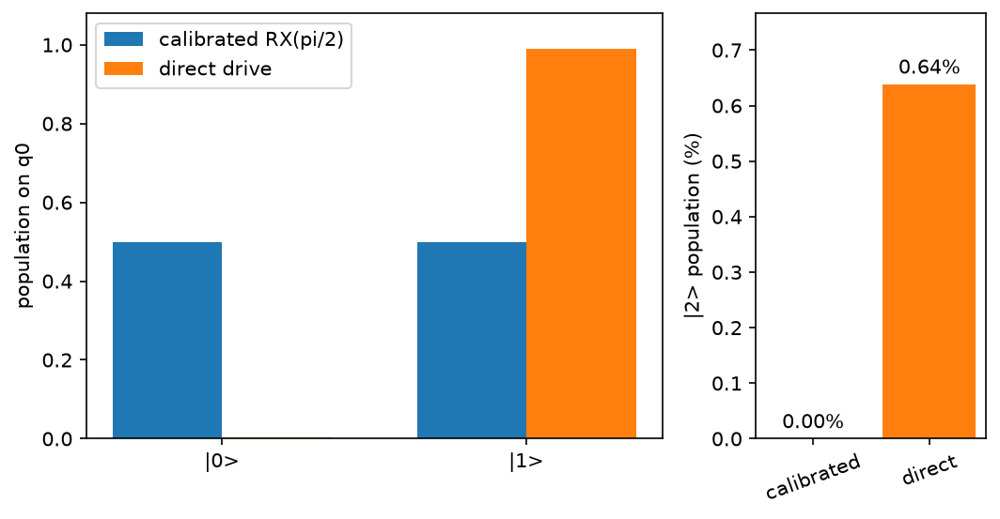

# 仿真超导系统

Transmon 在操作时用作量子比特，但建模时至少包含三个能级。
[`TransmonEmulator`][fatqat.emulator.TransmonEmulator] 会保留第三个能级，使
脉冲引发的泄漏能够与时序和耦合效应一起显现。它采用共同的
[哈密顿量仿真工作流](hamiltonian-emulation.md)。

## 加载可复现基线

随包文档描述两个相互耦合的物理 Transmon。它是仿真基线，而不是来自某台
具名设备的实时校准：

```pycon
>>> import numpy as np
>>> import fatqat as fq
>>> import fatqat.operations as ops
>>> model = fq.emulator.TransmonModel.from_document(
...     fq.emulator.load_model_document("transmon.reference")
... )
>>> model.subsystem_ids
('q0', 'q1')
>>> backend = fq.emulator.TransmonEmulator(model)
```

除非 [`ResourceLayout`][fatqat.ResourceLayout] 另有指定，否则 Program 量子
比特会按声明顺序绑定到这些子系统 ID。即使 Program 只寻址其中一个，每个模型
Transmon 仍会保留在物理状态中。

## 以已校准门的形式运行旋转

把本指南中的核心旋转作为普通 Program 操作复用。仿真器通过门实现映射和参考
校准来实现它：

```pycon
>>> rotation = fq.Program(1)
>>> rotation.add(ops.RX(np.pi / 2), 0)
>>> calibrated_rho = backend.run(rotation).result().get_density_matrix()
>>> calibrated_rho.shape
(9, 9)
```

Program 声明的是逻辑量子比特，但结果覆盖完整的双 Transmon 量子三能级空间。
若要检查 `q0`，请按 FatQat 的小端物理轴顺序重塑对角线，再对 `q1` 求和：

```pycon
>>> calibrated_physical = np.real(np.diag(calibrated_rho)).reshape(
...     (3, 3), order="F"
... )
>>> calibrated_q0 = calibrated_physical.sum(axis=1)
>>> np.allclose(calibrated_q0.sum(), 1.0)
True
>>> bool(calibrated_q0[2] < 1e-6)
True
```

这里，`calibrated_q0[2]` 是物理能级 `|2>` 上的布居。它是用于模拟 Transmon
泄漏的物理量子三能级系统，并非通用模拟器支持的逻辑量子三能级编程功能。

## 用直接驱动替换量子门

为了观察脉冲形状如何改变物理行为，请用同一个 Transmon 上的驱动替换已校准
`RX`。下面的脉冲故意采用陡峭边沿，以便让其泄漏清晰可见：

```pycon
>>> duration = 20.0
>>> drive = fq.emulator.SampledWaveform(
...     (0.0, duration),
...     (0.08, 0.08),
... )
>>> control = fq.emulator.PulseControl(model.control.drive("q0"), drive)
>>> direct = fq.Program(1)
>>> direct.add(ops.PulseOperation(duration, (control,)))
>>> direct_rho = backend.run(direct).result().get_density_matrix()
>>> direct_physical = np.real(np.diag(direct_rho)).reshape((3, 3), order="F")
>>> direct_q0 = direct_physical.sum(axis=1)
>>> q0_leakage = direct_q0[2]
>>> f"{100 * q0_leakage:.2f}%"
'0.64%'
```

`q0_leakage` 是被驱动 Transmon 最终处于物理能级 `|2>` 的概率。下图将这个
小数值放在单独的尺度上，使它不会消失在计算能级布居旁边。



??? example "复现此图"

    ```python
    import matplotlib.pyplot as plt
    import numpy as np
    import fatqat as fq
    import fatqat.operations as ops

    model = fq.emulator.TransmonModel.from_document(
        fq.emulator.load_model_document("transmon.reference")
    )
    backend = fq.emulator.TransmonEmulator(model)

    calibrated = fq.Program(1)
    calibrated.add(ops.RX(np.pi / 2), 0)
    calibrated_rho = backend.run(calibrated).result().get_density_matrix()

    duration = 20.0
    waveform = fq.emulator.SampledWaveform(
        (0.0, duration),
        (0.08, 0.08),
    )
    control = fq.emulator.PulseControl(model.control.drive("q0"), waveform)
    direct = fq.Program(1)
    direct.add(ops.PulseOperation(duration, (control,)))
    direct_rho = backend.run(direct).result().get_density_matrix()

    def q0_populations(rho):
        physical = np.real(np.diag(rho)).reshape((3, 3), order="F")
        return physical.sum(axis=1)

    calibrated_q0 = q0_populations(calibrated_rho)
    direct_q0 = q0_populations(direct_rho)
    assert np.allclose(calibrated_q0.sum(), 1.0)
    assert np.allclose(direct_q0.sum(), 1.0)

    levels = np.arange(2)
    width = 0.36
    fig, (population_ax, leakage_ax) = plt.subplots(
        1,
        2,
        figsize=(7.2, 3.8),
        gridspec_kw={"width_ratios": (2.5, 1.0)},
    )
    population_ax.bar(
        levels - width / 2,
        calibrated_q0[:2],
        width,
        label="calibrated RX(pi/2)",
    )
    population_ax.bar(
        levels + width / 2,
        direct_q0[:2],
        width,
        label="direct drive",
    )
    population_ax.set(
        xticks=levels,
        xticklabels=("|0>", "|1>"),
        ylabel="population on q0",
        ylim=(0.0, 1.08),
    )
    population_ax.legend()
    leakage_bars = leakage_ax.bar(
        ("calibrated", "direct"),
        100 * np.array((calibrated_q0[2], direct_q0[2])),
        color=("C0", "C1"),
    )
    leakage_ax.bar_label(leakage_bars, fmt="%.2f%%", padding=3)
    leakage_ax.set(ylabel="|2> population (%)")
    leakage_ax.set_ylim(0.0, max(0.75, 120 * direct_q0[2]))
    leakage_ax.tick_params(axis="x", rotation=20)
    fig.tight_layout()
    ```

## 了解何时更多物理细节会改变答案

- **耦合：** 双 Transmon 门只能用于模型中的耦合边，而未被寻址的相邻
  Transmon 仍然属于哈密顿量的一部分。
- **参考系与时序：** 已校准的参考系变换以及后续控制的布局可能改变相位，
  即使计算能级布居看起来相同。
- **连续噪声：** 以速率或时间形式声明的 Lindblad 项会在已经过的物理时间中
  持续作用，而不是只在线路操作边界作用一次。

使用已校准路径研究随包提供的门方案；当波形本身就是实验对象时，请使用直接
控制。两种形式也可以共存于同一个 Program。
[Transmon 仿真器 API](../api/pulse-emulator.md)列出了支持的单位、门、噪声
形式和求解器选项。
