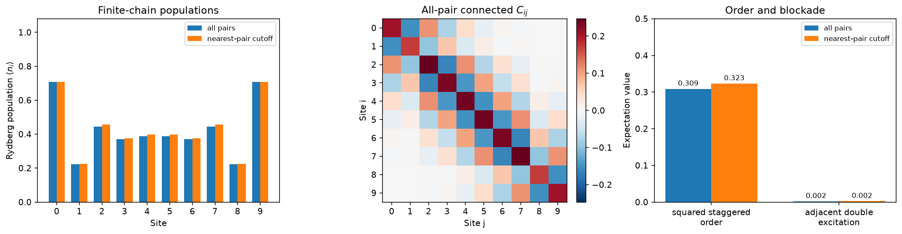

<!-- 中文译文人工维护；运行结果由 docs/mkdocs/tools/convert_tutorials.py 从规范源码同步。 -->

# 在里德伯原子链中建立反铁磁关联

<div class="grid cards" markdown>

-   :material-map-marker-path: **学习路径**

    中性原子物理

-   :material-language-python: **可执行源码**

    [下载 `plot_atom2level_antiferromagnetic_chain.py`](../downloads/tutorials/plot_atom2level_antiferromagnetic_chain.py){ download }

</div>

单个原子会产生 Rabi 振荡。将多个原子放得足够靠近，同样的激光驱动就变成了多体实验：附近同时出现两个里德伯激发需要付出相互作用能，因此相邻原子倾向处于相反状态。本教程利用这种竞争，在十格点链的相邻位点之间建立关联。

脉冲遵循里德伯阵列实验中采用的三阶段协议：在负失谐下开启驱动，将失谐扫描至有序区，然后关闭驱动。参见 [Bernien 等，Nature 551, 579 (2017)](https://doi.org/10.1038/nature24622) 与 [Lienhard 等，Physical Review X 8, 021070 (2018)](https://doi.org/10.1103/PhysRevX.8.021070)。

这是一个受上述实验启发的小型理想模拟，而非对实验的数值复制。软件包中的参考文档提供原子态和 $C_6$，因此我们将根据所选模型显式推导距离与频率尺度。

!!! info "基于源码的教程"

    说明文字是对版本库中教程源码的人工中文翻译，页面中的可执行单元保留规范源码。转换脚本从同一源码捕获运行结果；其中的英文标签来自源码的打印语句，保留原样以便核对。页面不显示仅用于 Sphinx-Gallery 验证的代码段。下载并直接运行 Python 文件即可复现图形与标准输出。

## 1. 加载物理模型

模型选择是显式的。文档会说明相互作用系数所对应的原子态与单位；在仿真器读取模型前，`from_document` 会先对其进行验证。

```python title="Python 单元 1"
import matplotlib.pyplot as plt
import numpy as np

import fatqat as fq
import fatqat.operations as ops

model_document = fq.emulator.load_model_document("atom2level.reference")
model = fq.emulator.Atom2LevelModel.from_document(model_document)

print("Model:", model_document["model"]["id"])
print("Basis:", model_document["system"]["basis"])
print("C6 unit:", model.c6_unit)
```

<!-- tutorial-result-start:cell-1 -->
!!! example "运行结果"

    ```text
    Model: rb87-53s-two-level-reference
    Basis: {'g': '5S1/2,F=2,mF=0', 'r': '53S1/2,mJ=+1/2'}
    C6 unit: rad/us*um^6
    ```

<!-- tutorial-result-end:cell-1 -->

## 2. 根据所需 ZZ 强度选择距离

在角频率单位下，原生里德伯哈密顿量为

$$
H(t) = \frac{\Omega(t)}{2}\sum_i X_i
       - \Delta(t)\sum_i n_i
       + \sum_{i<j} U_{ij} n_i n_j,
\qquad
U_{ij} = \frac{C_6}{R_{ij}^6},
$$

其中 $n_i=|r\rangle\langle r|_i$。这里没有遗漏 $2\pi$ 因子：在该模型中，`C6`、$\Omega$、$\Delta$ 和 $U$ 都使用 `rad/us` 单位。

为了显示 Pauli 耦合，代入 $n=(I-Z)/2$：

$$
U_{ij}n_i n_j
  = \frac{U_{ij}}{4}
    \left(I-Z_i-Z_j+Z_iZ_j\right).
$$

因此，$Z_iZ_j$ 前的系数是 $J_{ZZ}=U_{ij}/4$，而非 $U_{ij}$。我们选择整洁的峰值驱动 $\Omega_{max}=2\pi$ `rad/us`，其横场系数为 $h_x=\Omega_{max}/2$。要使 $J_{ZZ}=h_x$，必须满足 $U=2\Omega_{max}$。对应的间距是由模型推导出来的，并非凭空设定的神奇数字。

```python title="Python 单元 2"
NUM_SITES = 10
OMEGA_MAX = 2 * np.pi  # rad/us
U = 2 * OMEGA_MAX  # nearest-pair Rydberg interaction, rad/us
J_ZZ = U / 4
C6 = model.c6_angular_per_us_um6
SPACING = (C6 / U) ** (1 / 6)

arrangement = fq.emulator.AtomArrangement.chain(
    num_sites=NUM_SITES,
    spacing=SPACING,
)

print(f"Nearest-pair U / 2pi = {U / (2 * np.pi):.3f} MHz")
print(f"Transverse h_x / 2pi = {OMEGA_MAX / (4 * np.pi):.3f} MHz")
print(f"Pauli J_ZZ / 2pi = {J_ZZ / (2 * np.pi):.3f} MHz")
print(f"Derived spacing = {SPACING:.3f} um")
```

<!-- tutorial-result-start:cell-2 -->
!!! example "运行结果"

    ```text
    Nearest-pair U / 2pi = 2.000 MHz
    Transverse h_x / 2pi = 0.500 MHz
    Pauli J_ZZ / 2pi = 0.500 MHz
    Derived spacing = 4.932 um
    ```

<!-- tutorial-result-end:cell-2 -->

为什么选择十个格点？这已是一个 1024 维的多体态，但仍能在本地足够快地运行。偶数长度的链也迫使我们如实面对物理：它的开放边界允许多种低能模式，全局控制不一定会选中某一条完美交替比特串。因此，我们将同时测量格点布居数和序参量平方；后者无需假设唯一的最终模式就能识别交错关联。

## 3. 计入诱导纵场

合并所有 Pauli-Z 项后得到

$$
H(t) = \frac{\Omega(t)}{2}\sum_i X_i
  + \sum_i \left[
      \frac{\Delta(t)}{2}
      - \frac{1}{4}\sum_{j\ne i}U_{ij}
    \right]Z_i
  + \frac{1}{4}\sum_{i<j}U_{ij}Z_iZ_j
  + \text{constant}.
$$

在最近邻近似下，链内部的每个格点有两个相邻格点。选择 $\Delta=U$ 可抵消其诱导纵场。我们选取的峰值驱动使横场系数与 ZZ 系数相等：

$$
h_x=\frac{\Omega_{max}}{2}=\frac{U}{4}=J_{ZZ}.
$$

对周期性最近邻链的体内部分，这种抵消是精确的，但对本例的有限开放链并非如此。边缘格点只有一个邻居，仍保留 $+U Z/4$ 场。完整 $1/R^6$ 模型还会添加更小且与位置有关的偏移。单一全局失谐不可能抵消每个格点，本教程不会掩盖这一边界效应。

更重要的是，体内抵消并非这种态制备的最佳终点。在零驱动时，增加一个激发并同时创建一对相邻激发，会使能量改变 $-\Delta+U$；在 $\Delta=U$ 时这一过程不耗费能量。我们改为在 $\Delta=U/3$ 结束：正失谐有利于里德伯占据，但一对最近邻激发的代价仍高于额外激发所带来的收益。这会抑制相邻激发，却不会只剩下两条完美 Néel 比特串：有限开放链也允许包含畴壁的最大占据模式。最近邻相互作用使这些模式保持简并，完整的 $1/R^6$ 长程尾项则会轻微劈裂它们。因此，目标是短程反铁磁关联，而非制备完美的 Néel 态。尽管我们不在体内抵消值结束，该抵消公式仍有助于解读哈密顿量。

```python title="Python 单元 3"
DELTA_INITIAL = -1.5 * U
DELTA_FINAL = U / 3
```

## 4. 构建三阶段脉冲

初始时 $\Omega=0$，负失谐使 $|gg\ldots g\rangle$ 成为基态。随后我们：

1. 在保持 $\Delta$ 为负的同时抬高 $\Omega$；
2. 将 $\Delta$ 扫描至有序区；
3. 在固定正失谐下降低 $\Omega$。

每个两点 `SampledWaveform` 都是线性的。将时序拆成三个操作，可清晰显示其中的恒定区段与斜坡区段。

```python title="Python 单元 4"
T_RISE = 0.5
T_SWEEP = 1.0
T_FALL = 0.5


def pulse_stage(
    duration: float,
    omega: tuple[float, float],
    detuning: tuple[float, float],
) -> ops.PulseOperation:
    """Create one linear drive-and-detuning stage in model time units."""
    times = (0.0, duration)
    controls = (
        fq.emulator.PulseControl(
            model.control.drive(),
            fq.emulator.SampledWaveform(times, omega),
        ),
        fq.emulator.PulseControl(
            model.control.detuning(),
            fq.emulator.SampledWaveform(times, detuning),
        ),
    )
    return ops.PulseOperation(duration, controls)


program = fq.Program(arrangement.num_sites)
program.add(
    pulse_stage(
        T_RISE,
        omega=(0.0, OMEGA_MAX),
        detuning=(DELTA_INITIAL, DELTA_INITIAL),
    )
)
program.add(
    pulse_stage(
        T_SWEEP,
        omega=(OMEGA_MAX, OMEGA_MAX),
        detuning=(DELTA_INITIAL, DELTA_FINAL),
    )
)
program.add(
    pulse_stage(
        T_FALL,
        omega=(OMEGA_MAX, 0.0),
        detuning=(DELTA_FINAL, DELTA_FINAL),
    )
)
```

在运行前绘制控制波形是一项很有用的合理性检查。用 $U$ 归一化可清晰显示具有物理意义的比值。

```python title="Python 单元 5"
stage_boundaries = np.cumsum((0.0, T_RISE, T_SWEEP, T_FALL))
omega_nodes = np.array((0.0, OMEGA_MAX, OMEGA_MAX, 0.0))
detuning_nodes = np.array((DELTA_INITIAL, DELTA_INITIAL, DELTA_FINAL, DELTA_FINAL))

figure, axis = plt.subplots(figsize=(7, 4))
axis.plot(stage_boundaries, omega_nodes / U, marker="o", label=r"$\Omega/U$")
axis.plot(stage_boundaries, detuning_nodes / U, marker="o", label=r"$\Delta/U$")
for boundary in stage_boundaries[1:-1]:
    axis.axvline(boundary, color="0.8", linestyle="--", linewidth=1)
axis.axhline(0.0, color="0.25", linewidth=0.8)
axis.set(
    xlabel="Time (us)",
    ylabel="Control / U",
    title="Rise, detuning sweep, and fall",
)
axis.legend()
figure.tight_layout()
plt.show()
```

<!-- tutorial-result-start:cell-5 -->
!!! example "运行结果"

    

<!-- tutorial-result-end:cell-5 -->

## 5. 请求可观测量，而非测量采样

`ONE` 是投影算符 $|r\rangle\langle r|$，因此其期望值就是单个格点的里德伯布居数。我们请求全部单格点布居数以及格点对的布居数。由此可得到相邻格点对同时激发的平均概率：

$$
D_{nn}=\frac{1}{N-1}\sum_i\langle n_i n_{i+1}\rangle.
$$

以及连通关联函数：

$$
C_{ij}=\langle n_i n_j\rangle
       -\langle n_i\rangle\langle n_j\rangle.
$$

最近邻值为负表明，一个格点被激发后，其邻居被激发的可能性会下降。这正是上文所引实验测得的关联。

全局控制不一定会选定某一种交错取向，而开放边界也允许畴壁存在。因此，即使存在有意义的关联，带符号的交错磁化强度平均值仍可能为零。我们改用

$$
m_s = -\frac{1}{N}\sum_i(-1)^i Z_i,
\qquad
\langle m_s^2\rangle = \frac{1}{N^2}
  \sum_{i,j}(-1)^{i+j}\langle Z_iZ_j\rangle.
$$

两种完美交替模式都会给出 $\langle m_s^2\rangle=1$。将完整可观测量列表传给一次 `Estimator.run`，只会对程序演化一次，然后在同一最终态上评估每一个量。

```python title="Python 单元 6"
site_occupations = [
    fq.Observable.from_sparse(
        [("ONE", (site,), 1.0)],
        num_qubits=NUM_SITES,
    )
    for site in range(NUM_SITES)
]
pair_indices = [
    (first, second)
    for first in range(NUM_SITES)
    for second in range(first + 1, NUM_SITES)
]
pair_occupations = [
    fq.Observable.from_sparse(
        [(["ONE", "ONE"], pair, 1.0)],
        num_qubits=NUM_SITES,
    )
    for pair in pair_indices
]
staggered_order_squared = fq.Observable.from_sparse(
    [
        (
            "I",
            (0,),
            1 / NUM_SITES,
        )
    ]
    + [
        (
            "ZZ",
            (first, second),
            2 * (-1.0) ** (first + second) / NUM_SITES**2,
        )
        for first in range(NUM_SITES)
        for second in range(first + 1, NUM_SITES)
    ],
    num_qubits=NUM_SITES,
)
observables = site_occupations + pair_occupations + [staggered_order_squared]
```

## 6. 保留全部相互作用，再检验最近邻近似

第一个仿真器使用默认值 `interaction_cutoff=None`，保留每个无序原子对。第二个仿真器删除距离超过一个晶格间距的项。该截止是对哈密顿量的数值截断，而非阻塞半径。

在均匀链中，次近邻相互作用只有 $U/(2^6)=U/64$。这表明最近邻物理应能提供很好的解释，但下方的比较会直接检查演化态，而不是假定小哈密顿项始终无关紧要。

```python title="Python 单元 7"
backends = {
    "all pairs": fq.emulator.Atom2LevelEmulator(
        model,
        arrangement=arrangement,
    ),
    "nearest-pair cutoff": fq.emulator.Atom2LevelEmulator(
        model,
        arrangement=arrangement,
        interaction_cutoff=SPACING,
    ),
}

site_results = {}
double_results = {}
staggered_results = {}
connected_results = {}

for label, backend in backends.items():
    values = np.asarray(
        fq.Estimator(backend).run(program, observables).result().get_expectation()
    )
    occupations = values[:NUM_SITES]
    pair_values = values[NUM_SITES:-1]
    pair_lookup = dict(zip(pair_indices, pair_values))
    site_results[label] = occupations
    double_results[label] = float(
        np.mean([pair_lookup[(site, site + 1)] for site in range(NUM_SITES - 1)])
    )
    staggered_results[label] = float(values[-1])
    connected = np.diag(occupations * (1 - occupations))
    for (first, second), pair_value in pair_lookup.items():
        correlation = pair_value - occupations[first] * occupations[second]
        connected[first, second] = correlation
        connected[second, first] = correlation
    connected_results[label] = connected
    print(
        f"{label:>19}: "
        f"squared staggered order = {staggered_results[label]:.3f}, "
        f"adjacent double excitation = {double_results[label]:.3f}"
    )
```

<!-- tutorial-result-start:cell-7 -->
!!! example "运行结果"

    ```text
              all pairs: squared staggered order = 0.309, adjacent double excitation = 0.002
    nearest-pair cutoff: squared staggered order = 0.323, adjacent double excitation = 0.002
    ```

<!-- tutorial-result-end:cell-7 -->

对任意一种理想交替模式，交错序参量平方都为一。作为对照，无关联的均匀随机态的基线为 $1/N$。对两种完美交替取向，相邻双激发概率都为零。将两者结合，就能把反铁磁关联与毫无特征的状态以及仅具有正确平均激发密度的状态区分开来。

## 7. 解读多体结果

```python title="Python 单元 8"
sites = np.arange(NUM_SITES)
bar_width = 0.36
figure, (density_axis, correlation_axis, summary_axis) = plt.subplots(
    1, 3, figsize=(15, 4)
)

for index, (label, occupations) in enumerate(site_results.items()):
    offset = (index - 0.5) * bar_width
    density_axis.bar(sites + offset, occupations, bar_width, label=label)

density_axis.set(
    xlabel="Site",
    ylabel=r"Rydberg population $\langle n_i\rangle$",
    xticks=sites,
    ylim=(0.0, 1.08),
    title="Finite-chain populations",
)
density_axis.legend(fontsize="small")

physical_correlations = connected_results["all pairs"]
color_bound = np.max(np.abs(physical_correlations))
image = correlation_axis.imshow(
    physical_correlations,
    cmap="RdBu_r",
    vmin=-color_bound,
    vmax=color_bound,
)
correlation_axis.set(
    xlabel="Site j",
    ylabel="Site i",
    xticks=sites,
    yticks=sites,
    title=r"All-pair connected $C_{ij}$",
)
figure.colorbar(image, ax=correlation_axis, fraction=0.046, pad=0.04)

metric_names = ("squared staggered\norder", "adjacent double\nexcitation")
metric_positions = np.arange(len(metric_names))
for index, label in enumerate(backends):
    offset = (index - 0.5) * bar_width
    bars = summary_axis.bar(
        metric_positions + offset,
        (staggered_results[label], double_results[label]),
        bar_width,
        label=label,
    )
    summary_axis.bar_label(bars, fmt="%.3f", padding=2, fontsize="small")

summary_axis.set(
    ylabel="Expectation value",
    xticks=metric_positions,
    xticklabels=metric_names,
    ylim=(0.0, 0.5),
    title="Order and blockade",
)
summary_axis.legend(fontsize="small")
figure.tight_layout()
plt.show()
```

<!-- tutorial-result-start:cell-8 -->
!!! example "运行结果"

    

<!-- tutorial-result-end:cell-8 -->

单格点布居图具有反射对称性，并明显受到开放边缘影响；它不会伪装有限链已选定某条完美比特串。连通关联矩阵展现出更清晰的多体特征：其符号随格点间距交替，相邻双激发则被强烈抑制。保留全部 $C_6/R^6$ 原子对与仅保留最近邻原子对，会得到定性相同的状态；两者之间较小的定量差异来自长程尾项以及与之相关的位置依赖 Z 偏移。保留所有原子对的结果是默认物理模型；截断结果则有助于显示熟悉的最近邻 Ising 解释。
