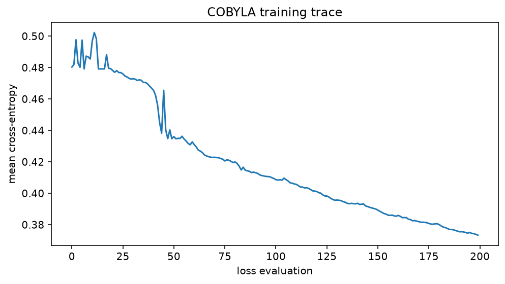
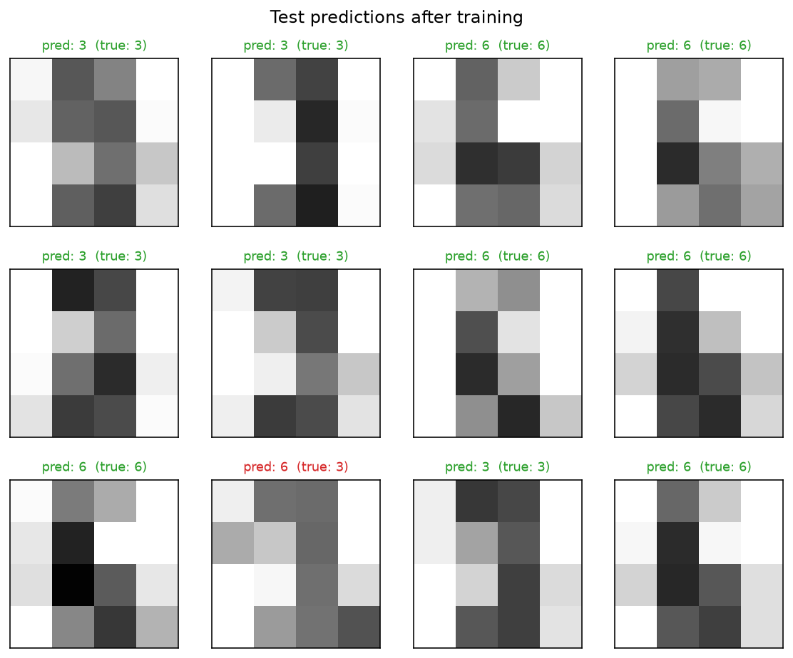

<!-- 中文译文人工维护；运行结果由 docs/mkdocs/tools/convert_tutorials.py 从规范源码同步。 -->

# 使用量子神经网络识别手写数字

<div class="grid cards" markdown>

-   :material-map-marker-path: **学习路径**

    算法

-   :material-language-python: **可执行源码**

    [下载 `plot_qnn_digits.py`](../downloads/tutorials/plot_qnn_digits.py){ download }

</div>

量子神经网络（QNN）分类器本质上是普通的参数化函数 $f(x;\theta)$，不同之处在于该函数由量子电路评估。输入特征 $x$ 和可训练权重 $\theta$ 都以旋转角的形式进入电路，各类别的得分则从最终态的期望值中读出。

本教程训练这样的分类器来区分手写数字 3 和 6，并展示 fatqat 相比“每个样本构建一条电路”的朴素工作流所提供的关键能力：**电路只构建一次，作为参数化模板；整批输入只需一次** `run_sweep` **调用即可评估**。

## 模型

在多轮操作中，每个量子比特交替施加*编码*门 $R_Y(x)$ 与*可训练*门 $R_Z(\theta)$，再用 CX 环将它们纠缠；这就是 Pérez-Salinas 等人提出的*数据重上传*模式（[arXiv:1907.02085](https://arxiv.org/abs/1907.02085)）。对于四个量子比特和四轮操作，

$$
|\psi(x;\theta)\rangle = U(x;\theta)\,|0\rangle^{\otimes 4},
\qquad
U(x;\theta) = \prod_{r=1}^{4} U_{\mathrm{ring}}
\left[\bigotimes_{q=0}^{3} R_Z(\theta_{r,q})\,R_Y(x_{r,q})\right],
$$

因此，16 个特征和 16 个权重每轮在每个量子比特上各使用一个。每轮都重新上传相同特征，使得小型电路也能拟合非线性决策边界。

读出方式遵循 Farhi 与 Neven 的方法（[arXiv:1802.06002](https://arxiv.org/abs/1802.06002)）：测量四个单量子比特期望值 $\langle Z_q\rangle$，并将其合并为两个类别的 logit：

$$
\ell_3 = \langle Z_0\rangle + \langle Z_1\rangle,
\qquad
\ell_6 = \langle Z_2\rangle + \langle Z_3\rangle,
\qquad
p = \mathrm{softmax}(\ell).
$$

训练通过无梯度的 COBYLA 优化器将平均交叉熵 $-\frac{1}{N}\sum_i \log p_i(\text{label}_i)$ 最小化。损失是一个黑盒，因此无需对电路求导。

数据是 scikit-learn 自带的 $8\times8$ 手写数字图像：它们是真实扫描结果，但已随软件包保存在本地，因此无需下载数据即可完整复现本页结果。所有随机源都设置了种子。

!!! info "基于源码的教程"

    说明文字是对版本库中教程源码的人工中文翻译，页面中的可执行单元保留规范源码。转换脚本从同一源码捕获运行结果；其中的英文标签来自源码的打印语句，保留原样以便核对。页面不显示仅用于 Sphinx-Gallery 验证的代码段。下载并直接运行 Python 文件即可复现图形与标准输出。

## 数据：两类小型数字图像

数字 3 和 6 组成的子集由带种子的生成器打乱，每张 $8\times8$ 图像通过平均池化缩小为 $4\times4$，每轮每个量子比特对应一个特征。像素值（0–16）被缩放到 $[0, \pi]$ 内的角度，因此空白像素编码为恒等旋转 $R_Y(0) = I$，而单个 $R_Y(x)$ 所产生的 $\langle Z\rangle = \cos x$ 中的 $\cos$ 则会保留亮度次序。

```python title="Python 单元 1"
import matplotlib.pyplot as plt
import numpy as np
from scipy.optimize import minimize
from sklearn.datasets import load_digits

import fatqat as fq
import fatqat.operations as ops

NUM_QUBITS = 4
NUM_ROUNDS = 4  # 4 rounds x 4 qubits consume the 16 pooled pixels
NUM_PARAMS = NUM_QUBITS * NUM_ROUNDS

digits = load_digits()
subset = (digits.target == 3) | (digits.target == 6)
images = digits.images[subset]
labels = (digits.target[subset] == 6).astype(int)  # 0 for "3", 1 for "6"

rng = np.random.default_rng(0)
order = rng.permutation(len(labels))
images, labels = images[order], labels[order]

pooled = images.reshape(-1, 4, 2, 4, 2).mean(axis=(2, 4))  # 8x8 -> 4x4
features = pooled.reshape(-1, 16) / 16.0 * np.pi

N_TRAIN = 120
X_train, y_train = features[:N_TRAIN], labels[:N_TRAIN]
X_test, y_test = features[N_TRAIN:], labels[N_TRAIN:]
print(f"train {len(y_train)} samples, test {len(y_test)} samples")
```

<!-- tutorial-result-start:cell-1 -->
!!! example "运行结果"

    ```text
    train 120 samples, test 244 samples
    ```

<!-- tutorial-result-end:cell-1 -->

电路看到的是这个 $4\times4$ 池化结果，而非原始的 $8\times8$ 扫描图像。

```python title="Python 单元 2"
fig, axes = plt.subplots(2, 4, figsize=(8, 4.5))
for ax, image, label in zip(axes.ravel(), pooled[:8], labels[:8]):
    ax.imshow(image, cmap="gray_r", vmin=0, vmax=16)
    ax.set_title(f"true: {'6' if label else '3'}")
    ax.set_xticks([])
    ax.set_yticks([])
fig.suptitle("Model input: 4x4 average-pooled digits")
fig.tight_layout(h_pad=2.5)
```

<!-- tutorial-result-start:cell-2 -->
!!! example "运行结果"

    

<!-- tutorial-result-end:cell-2 -->

## 试探态：一个参数化模板

[`ParameterVector`][fatqat.ParameterVector] 是一组具名占位符。添加量子门时以占位符代替数值，就会得到一个*模板*：其程序结构固定，角度留待之后绑定。绑定始终返回新程序，绝不改变模板，因此一个模板就能服务于所有样本和每个优化步骤。

```python title="Python 单元 3"
FEATURES = fq.ParameterVector("features", NUM_PARAMS)
WEIGHTS = fq.ParameterVector("weights", NUM_PARAMS)


def build_template():
    """The data-re-uploading circuit, built once with placeholders."""
    program = fq.Program(NUM_QUBITS)
    for r in range(NUM_ROUNDS):
        for q in range(NUM_QUBITS):
            program.add(ops.RY(FEATURES[r * NUM_QUBITS + q]), q)
            program.add(ops.RZ(WEIGHTS[r * NUM_QUBITS + q]), q)
        for q in range(NUM_QUBITS):
            program.add(ops.CX, (q, (q + 1) % NUM_QUBITS))
    return program


template = build_template()
```

该模板与其他程序一样可视化：每轮在每条量子线上先施加 `RY(x)`，再施加 `RZ(θ)`，并以 CX 环收尾，共重复四次。

```python title="Python 单元 4"
figure = template.draw("matplotlib")
figure.set_size_inches(16, 4)
```

## 用一次 `run_sweep` 评估整个批次

在一个优化步骤内，权重是固定的，因此只需用 `assign_parameters` 绑定一次。随后，批次扫描只改变特征：`run_sweep` 将完整的 `(N, 16)` 特征数组作为一次绑定传入，并返回有序的结果列表，每个样本对应一个普通 `Result`。参数已变成*数据*：普通 NumPy 数组流经一次调用，无需为每个样本重建电路结构。

（在当前 fatqat 版本中，`run_sweep` 仍然逐行降级并执行；目前的主要收益在于单模板工作流和一次调用的批处理接口，未来的融合批量执行也会接入这个接口。对以可观测量为中心的工作流，[`fatqat.Estimator`][fatqat.Estimator] 通过 `Estimator.run_sweep` 提供相同的批处理能力；请参阅[模拟指南](../guide/simulation.md)。）

```python title="Python 单元 5"
backend = fq.simulator.Simulator(method="SV")


def batch_logits(params, X):
    """Map a batch of samples to class logits with one sweep call."""
    bound = template.assign_parameters({WEIGHTS: params})
    results = backend.run_sweep(
        bound,
        {FEATURES: X},
        shots=0,
        result_config={"counts": False, "final_state": True},
    ).result()
    states = np.array([r.get_statevector() for r in results])  # (N, 16)
    axes = [
        entry["register_ref"].index for entry in results[0].metadata["state_axes"]
    ]
    return z_logits(states, axes)


def z_logits(states, axes):
    """Contract four :math:`\\langle Z_q\\rangle` from final statevectors.

    The flat statevector is little-endian over the engine's axes, and the
    result's ``state_axes`` metadata says which engine axis each qubit was
    assigned to — contracting along those axes avoids any endianness
    assumption. A Fortran-order reshape puts engine axis ``k`` on NumPy
    axis ``k``; contracting qubit's axis with :math:`(1, -1)` gives
    :math:`\\langle Z_q\\rangle`, and summing the remaining axes
    marginalizes them.
    """
    probs = np.abs(states) ** 2
    tensor = probs.reshape(len(states), *([2] * NUM_QUBITS), order="F")
    z = np.array([1.0, -1.0])
    expectations = np.stack(
        [
            np.tensordot(tensor, z, axes=([1 + axes.index(q)], [0])).sum(
                axis=(1, 2, 3)
            )
            for q in range(NUM_QUBITS)
        ],
        axis=1,
    )  # (N, 4): <Z0> .. <Z3>
    return expectations.reshape(len(states), 2, 2).sum(-1)
```

先用随机初始权重做一个小检查：与未训练电路的预期一致，logit 从零附近起步。

```python title="Python 单元 6"
x0 = rng.uniform(-0.1, 0.1, NUM_PARAMS)
print("logits of the first three test images at initialization:")
print(batch_logits(x0, X_test[:3]))
```

<!-- tutorial-result-start:cell-6 -->
!!! example "运行结果"

    ```text
    logits of the first three test images at initialization:
    [[-0.643 -0.565]
     [ 0.02  -0.655]
     [-0.527  1.053]]
    ```

<!-- tutorial-result-end:cell-6 -->

## 训练

损失是训练批次上的平均 softmax 交叉熵。评估一次损失，就是对全部 120 张训练图像调用一次 `run_sweep`。

```python title="Python 单元 7"
def batch_loss(params, X, y, trace=None):
    """Mean softmax cross-entropy over a batch."""
    logits = batch_logits(params, X)
    shifted = logits - logits.max(axis=1, keepdims=True)
    p = np.exp(shifted)
    p /= p.sum(axis=1, keepdims=True)
    loss = -np.log(p[np.arange(len(y)), y]).mean()
    if trace is not None:
        trace.append(loss)
        if len(trace) % 25 == 0:
            print(f"eval {len(trace):4d}  train loss {loss:.4f}")
    return loss


trace = []
result = minimize(
    batch_loss,
    x0,
    args=(X_train, y_train, trace),
    method="COBYLA",
    options={"maxiter": 200, "rhobeg": 0.5},
)
print(f"final train loss {result.fun:.4f} after {len(trace)} evaluations")
```

<!-- tutorial-result-start:cell-7 -->
!!! example "运行结果"

    ```text
    eval   25  train loss 0.4768
    eval   50  train loss 0.4347
    eval   75  train loss 0.4217
    eval  100  train loss 0.4094
    eval  125  train loss 0.3983
    eval  150  train loss 0.3900
    eval  175  train loss 0.3813
    eval  200  train loss 0.3734
    final train loss 0.3734 after 200 evaluations
    ```

<!-- tutorial-result-end:cell-7 -->

```python title="Python 单元 8"
fig, ax = plt.subplots(figsize=(7, 4))
ax.plot(trace)
ax.set_xlabel("loss evaluation")
ax.set_ylabel("mean cross-entropy")
ax.set_title("COBYLA training trace")
fig.tight_layout()
```

<!-- tutorial-result-start:cell-8 -->
!!! example "运行结果"

    

<!-- tutorial-result-end:cell-8 -->

## 评估

在留出的测试集上评估训练后的权重；这里同样只需对整个批次扫描一次。

```python title="Python 单元 9"
test_logits = batch_logits(result.x, X_test)
test_accuracy = (test_logits.argmax(axis=1) == y_test).mean()
print(f"test accuracy {test_accuracy:.1%} on {len(y_test)} images")
```

<!-- tutorial-result-start:cell-9 -->
!!! example "运行结果"

    ```text
    test accuracy 97.1% on 244 images
    ```

<!-- tutorial-result-end:cell-9 -->

下面展示一组测试集预测样例，误分结果以红色标出。

```python title="Python 单元 10"
fig, axes = plt.subplots(3, 4, figsize=(8, 6.5))
offset = N_TRAIN  # pooled/labels indices corresponding to X_test
for k, ax in enumerate(axes.ravel()):
    prediction = test_logits[k].argmax()
    correct = prediction == y_test[k]
    ax.imshow(pooled[offset + k], cmap="gray_r", vmin=0, vmax=16)
    ax.set_title(
        f"pred: {'6' if prediction else '3'}  (true: {'6' if y_test[k] else '3'})",
        color="tab:green" if correct else "tab:red",
        fontsize=9,
    )
    ax.set_xticks([])
    ax.set_yticks([])
fig.suptitle("Test predictions after training")
fig.tight_layout(h_pad=2.5)
```

<!-- tutorial-result-start:cell-10 -->
!!! example "运行结果"

    

<!-- tutorial-result-end:cell-10 -->

## 下一步

* [Program 指南](../guide/program.md)介绍参数绑定；[模拟指南](../guide/simulation.md)讲解扫描，[解读结果](../guide/interpret-results.md)则涵盖精确与采样期望值。
* 很自然的扩展方向包括：增加轮数或量子比特，向模拟器传入噪声模型，或使用采样期望值（`shots > 0`）研究采样噪声对训练曲线的影响。
