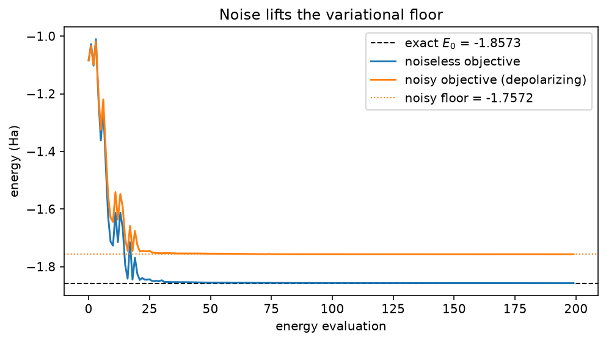

<!-- 中文译文人工维护；运行结果由 docs/mkdocs/tools/convert_tutorials.py 从规范源码同步。 -->

# 使用 VQE 求解 H₂ 的基态能量

<div class="grid cards" markdown>

-   :material-map-marker-path: **学习路径**

    算法

-   :material-language-python: **可执行源码**

    [下载 `plot_vqe_h2.py`](../downloads/tutorials/plot_vqe_h2.py){ download }

</div>

变分量子本征求解器（VQE）利用变分原理 $E(\theta) \geq E_0$ 估计哈密顿量 $H$ 的基态能量：参数化电路制备 $|\psi(\theta)\rangle$，能量

$$
E(\theta) = \langle\psi(\theta)|H|\psi(\theta)\rangle
$$

由量子处理器评估，经典优化器则沿能量下降方向更新 $\theta$。找到的最低能量是真实基态能量 $E_0$ 的上界。

本教程在最小而又具有非平凡意义的量子化学范例上运行完整循环：使用 STO-3G 基组的氢分子，再通过量子比特缩减降到两个量子比特（采用 O'Malley 等人在 [arXiv:1512.06860](https://arxiv.org/abs/1512.06860) 中的形式）。哈密顿量是五个 Pauli 项之和：

$$
H = -1.0524\,II + 0.3979\,IZ - 0.3979\,ZI - 0.0113\,ZZ + 0.1809\,XX,
$$

因此，能量是各期望值的加权和——这正是 Estimator 通过一次电路评估所计算的量。

教程源码包含三个可执行阶段：

1. **精确 VQE**——根据态矢量精确评估能量，再由 COBYLA 将其最小化。收敛曲线与稠密对角化所得的精确基态能量比较。
2. **有限采样 VQE**——重复相同的循环，但每个期望值由 1024 次采样估计，并显式给出统计标准误差。
3. **噪声下的 VQE**——为模拟器附加去极化噪声模型，能量下限因而抬升；用最精简的方式展示 NISQ 量子化学为何困难。

所有随机过程都设置了种子，在笔记本电脑的 CPU 上数秒即可运行完毕。

!!! info "基于源码的教程"

    说明文字是对版本库中教程源码的人工中文翻译，页面中的可执行单元保留规范源码。转换脚本从同一源码捕获运行结果；其中的英文标签来自源码的打印语句，保留原样以便核对。页面不显示仅用于文档验证的代码段。下载并直接运行 Python 文件即可复现图形与标准输出。

## 哈密顿量及其精确能谱

五个 Pauli 项以内联数据表示。Pauli 字符串遵循“*最左字符 = 量子比特 0*”的约定：`IZ` 表示在量子比特 1 上施加 $Z$。

对 $4\times4$ 矩阵作稠密对角化即可得到精确基态能量。它有两个作用：作为收敛图中的参考线，也提醒我们变分原理给出的是*最小*本征值的界。其余三个本征值也会打印，便于参照。

```python title="Python 单元 1"
import matplotlib.pyplot as plt
import numpy as np
from scipy.optimize import minimize

import fatqat as fq
import fatqat.operations as op

H2_TERMS = [
    # (Pauli string, coefficient); leftmost character acts on qubit 0.
    ("II", -1.052373245772859),
    ("IZ", +0.39793742484318045),
    ("ZI", -0.39793742484318045),
    ("ZZ", -0.01128010425623538),
    ("XX", +0.18093119978423156),
]

PAULI = {
    "I": np.eye(2),
    "X": np.array([[0, 1], [1, 0]]),
    "Y": np.array([[0, -1j], [1j, 0]]),
    "Z": np.array([[1, 0], [0, -1]]),
}

# np.kron places the first factor on the high tensor factor, so this matrix
# is big-endian (qubit 0 = high bit) — the opposite of fatqat's statevector
# order. Only its eigenvalues are used below, and those are unaffected by
# the qubit-ordering convention.
H_MATRIX = sum(
    coeff * np.kron(PAULI[pauli[0]], PAULI[pauli[1]]) for pauli, coeff in H2_TERMS
)
eigenvalues = np.linalg.eigvalsh(H_MATRIX)
E0 = eigenvalues[0]
print("exact spectrum:", np.round(eigenvalues, 5))
print(f"ground-state energy E0 = {E0:.5f} Ha")

CHEMICAL_ACCURACY = 1.6e-3  # 1.6 mHa, the conventional accuracy target
```

<!-- tutorial-result-start:cell-1 -->
!!! example "运行结果"

    ```text
    exact spectrum: [-1.857 -1.245 -0.883 -0.225]
    ground-state energy E0 = -1.85728 Ha
    ```

<!-- tutorial-result-end:cell-1 -->

单位项在任何状态下的期望值都为 1，因此可并入常数偏置。优化器实际只会看到四个非单位期望值：

```python title="Python 单元 2"
OFFSET = H2_TERMS[0][1]  # the II coefficient
COEFFS = np.array([coeff for pauli, coeff in H2_TERMS[1:]])
```

## 将哈密顿量表示为可观测量

每个非单位 Pauli 项都通过 `from_sparse` 构建为一个 `fq.Observable`：只指定非单位因子，并将它们显式写成 `(pauli, (qubit,), coefficient)` 条目。显式的量子比特索引可避免上文提到的字符串端序陷阱（`IZ` 表示*量子比特 1 上的 Z*）。一条记录表示一个乘积——`("ZZ", (0, 1), 1.0)` 是单个 $Z_0 Z_1$ 项，而两条记录则会相加。每个可观测量的系数都是 1.0；哈密顿量系数保存在 `COEFFS` 中，由经典端施加，所以能量等于 `OFFSET` 加上四个期望值的加权和。

```python title="Python 单元 3"
NUM_QUBITS = 2
NUM_ROUNDS = 2

OBSERVABLES = [
    fq.Observable.from_sparse([("Z", (1,), 1.0)], num_qubits=NUM_QUBITS),    # IZ
    fq.Observable.from_sparse([("Z", (0,), 1.0)], num_qubits=NUM_QUBITS),    # ZI
    fq.Observable.from_sparse([("ZZ", (0, 1), 1.0)], num_qubits=NUM_QUBITS),
    fq.Observable.from_sparse([("XX", (0, 1), 1.0)], num_qubits=NUM_QUBITS),
]
```

## 试探态：参数化模板

`THETA` 是长度为 4 的 `fq.ParameterVector`，也就是一组具名占位符。`build_template()` 用占位符代替角度，组装两量子比特试探态：共两层，每层都在两条量子线上施加 `RY`（每条线一个参数），并以量子比特 0 到量子比特 1 的 `CX` 结束。模板只构建一次；绑定操作会返回新程序，绝不会改变模板本身。

由于哈密顿量是实的，其基态也可选为实态。四个 `RY` 角与纠缠门交错后能够覆盖任意实的两量子比特态，因此原则上这个试探态可以达到 $E_0$。

```python title="Python 单元 4"
THETA = fq.ParameterVector("theta", 4)
def build_template():
    program = fq.Program(NUM_QUBITS)
    for r in range(NUM_ROUNDS):
        for q in range(NUM_QUBITS):
            program.add(op.RY(THETA[r * NUM_QUBITS + q]), q)
        program.add(op.CX, (0, 1))
    return program

template = build_template()
```

该模板与其他程序一样可视化：两层带参数的 `RY` 旋转，每层都以纠缠门收尾。

```python title="Python 单元 5"
figure = template.draw("matplotlib")
figure.set_size_inches(10, 3)
```

## 精确能量函数

一次能量评估先将模板绑定到当前参数——`Estimator.run` 会拒绝仍包含未绑定参数的程序——然后在同一次演化上评估全部四个可观测量。`shots=0` 是 Estimator 的默认设置，此时期望值是精确的；能量等于它们的加权和再加单位项偏置。

```python title="Python 单元 6"
ESTIMATOR_SV = fq.Estimator(fq.simulator.Simulator(method="SV"))


def energy_exact(theta):
    """Exact energy of the ansatz at ``theta``"""
    bound = template.assign_parameters({THETA: theta})
    expectations = ESTIMATOR_SV.run(bound, OBSERVABLES).result().get_expectation()
    return float(OFFSET + COEFFS @ expectations)
```

## 优化

COBYLA 从幅度较小的随机初值出发，将黑盒能量最小化，无需梯度。计算轨迹会被记录下来用于绘制收敛图。

```python title="Python 单元 7"
rng = np.random.default_rng(0)
x0 = rng.uniform(-0.1, 0.1, 4)


def _trace(energy, theta, trace):
    value = energy(theta)
    trace.append(value)
    if len(trace) % 25 == 0:
        print(f"eval {len(trace):4d}  energy {value:.5f}")
    return value


trace_exact = []
result_exact = minimize(
    lambda theta: _trace(energy_exact, theta, trace_exact),
    x0,
    method="COBYLA",
    options={"maxiter": 200, "rhobeg": 0.5},
)
print(f"exact VQE minimum {result_exact.fun:.5f} Ha "
      f"(error {result_exact.fun - E0:+.5f} Ha)")
```

<!-- tutorial-result-start:cell-7 -->
!!! example "运行结果"

    ```text
    eval   25  energy -1.84524
    eval   50  energy -1.85557
    eval   75  energy -1.85627
    eval  100  energy -1.85675
    eval  125  energy -1.85698
    eval  150  energy -1.85709
    eval  175  energy -1.85720
    eval  200  energy -1.85722
    exact VQE minimum -1.85722 Ha (error +0.00006 Ha)
    ```

<!-- tutorial-result-end:cell-7 -->

```python title="Python 单元 8"
fig, ax = plt.subplots(figsize=(7, 4))
ax.axhline(E0, color="k", ls="--", lw=1, label=f"exact $E_0$ = {E0:.4f}")
ax.axhspan(E0, E0 + CHEMICAL_ACCURACY, color="tab:green", alpha=0.2,
           label="chemical accuracy (1.6 mHa)")
ax.plot(trace_exact, label="exact VQE trace")
ax.set_xlabel("energy evaluation")
ax.set_ylabel("energy (Ha)")
ax.set_title("Exact VQE converges to the ground state")
ax.legend()
fig.tight_layout()
```

<!-- tutorial-result-start:cell-8 -->
!!! example "运行结果"

    

<!-- tutorial-result-end:cell-8 -->

## 有限采样的期望值

接下来以硬件实际返回结果的方式估计同一个能量：每个期望值来自 1024 次测量采样。`shots` 是每次运行的选项，而非估计器的属性，因此同一个估计器可同时用于精确和采样评估。显式设置 `simulation_config={"seed": ...}` 会在每次评估时复用相同的随机性，从而使优化器看到确定的目标地形。`sampled_std` 以平方和开方的方式，通过权重传播每个可观测量的标准误差（`get_std()`）：$\sigma_E = \sqrt{\sum_i c_i^2 \sigma_i^2}$。它给出含噪目标函数误差条的尺度。

```python title="Python 单元 9"
def energy_sampled(theta):
    """Finite-shot energy of the ansatz at ``theta``."""
    bound = template.assign_parameters({THETA: theta})
    expectations = (
        ESTIMATOR_SV.run(
            bound, OBSERVABLES, shots=1024, simulation_config={"seed": 7}
        )
        .result()
        .get_expectation()
    )
    return float(OFFSET + COEFFS @ expectations)


def sampled_std(theta):
    """Standard error of the finite-shot energy."""
    bound = template.assign_parameters({THETA: theta})
    std = (
        ESTIMATOR_SV.run(
            bound, OBSERVABLES, shots=1024, simulation_config={"seed": 7}
        )
        .result()
        .get_std()
    )
    return float(np.sqrt(COEFFS**2 @ std**2))
```

再次运行 COBYLA，这次优化含噪目标。请注意，最终真正重要的是所得参数点的*精确*能量；采样噪声只是在引导搜索过程。

```python title="Python 单元 10"
trace_sampled = []
result_sampled = minimize(
    lambda theta: _trace(energy_sampled, theta, trace_sampled),
    x0,
    method="COBYLA",
    options={"maxiter": 200, "rhobeg": 0.5},
)
final_exact = energy_exact(result_sampled.x)
final_std = sampled_std(result_sampled.x)
print(f"finite-shot VQE stopped at {result_sampled.fun:.5f} ± {final_std:.5f} Ha")
print(f"exact energy at that point: {final_exact:.5f} Ha "
      f"(error {final_exact - E0:+.5f} Ha)")
```

<!-- tutorial-result-start:cell-10 -->
!!! example "运行结果"

    ```text
    eval   25  energy -1.86072
    eval   50  energy -1.86258
    finite-shot VQE stopped at -1.86258 ± 0.00676 Ha
    exact energy at that point: -1.85536 Ha (error +0.00191 Ha)
    ```

<!-- tutorial-result-end:cell-10 -->

```python title="Python 单元 11"
fig, (ax, ax_zoom) = plt.subplots(1, 2, figsize=(11, 4))
ax.axhline(E0, color="k", ls="--", lw=1, label=f"exact $E_0$ = {E0:.4f}")
ax.plot(trace_exact, label="exact objective")
ax.plot(trace_sampled, alpha=0.8, label="finite-shot objective (1024 shots)")
ax.set_xlabel("energy evaluation")
ax.set_ylabel("energy (Ha)")
ax.set_title("Finite-shot VQE: full traces")
ax.legend()

cut = 20  # skip the initial transient
ax_zoom.axhline(E0, color="k", ls="--", lw=1, label=f"exact $E_0$ = {E0:.4f}")
ax_zoom.axhspan(E0, E0 + CHEMICAL_ACCURACY, color="tab:green", alpha=0.2,
                label="chemical accuracy (1.6 mHa)")
ax_zoom.plot(range(cut, len(trace_exact)), trace_exact[cut:],
             label="exact objective")
ax_zoom.plot(range(cut, len(trace_sampled)), trace_sampled[cut:],
             alpha=0.8, marker=".", ms=4, label="finite-shot objective")
ax_zoom.errorbar(
    len(trace_sampled) - 1,
    trace_sampled[-1],
    yerr=final_std,
    fmt="o",
    color="tab:orange",
    capsize=4,
    label="standard error",
)
ax_zoom.set_xlabel("energy evaluation")
ax_zoom.set_title("zoom: riding the statistical noise")
ax_zoom.legend()
fig.tight_layout()
```

<!-- tutorial-result-start:cell-11 -->
!!! example "运行结果"

    

<!-- tutorial-result-end:cell-11 -->

## 去极化噪声模型

噪声可以独立于程序声明：`fq.NoiseModel` 保存物理噪声声明。本例在每个 `RY` 之后添加 `fq.noise.Depolarizing`（$p = 0.01$），在每个 `CX` 之后添加更强的去极化噪声（$p = 0.05$）；相同模板在由该模型构建的密度矩阵模拟器上运行。密度矩阵 Estimator 在 `shots=0` 模式下会精确返回噪声平均后的期望值：无需采样就能*看到*噪声。完整工作流请参阅[理想与含噪声执行](../guide/ideal-and-noisy.md)。

```python title="Python 单元 12"
noise = fq.NoiseModel()
noise.add(fq.noise.Depolarizing(p=0.01), operation=op.RY)
noise.add(fq.noise.Depolarizing(p=0.05), operation=op.CX)
ESTIMATOR_NOISY = fq.Estimator(fq.simulator.Simulator(method="DM", noise=noise))


def energy_noisy(theta):
    """Noise-averaged energy of the ansatz at ``theta``."""
    bound = template.assign_parameters({THETA: theta})
    expectations = ESTIMATOR_NOISY.run(bound, OBSERVABLES).result().get_expectation()
    return float(OFFSET + COEFFS @ expectations)
```

首先观察性能下降：在噪声下重新评估精确 VQE 的最小值。然后让 COBYLA 在噪声下重新优化，但几乎无法挽回损失：变分试探态无法通过旋转消除单位噪声，所以被抬高的能量下限始终存在（它只能在经典端被缓解，而不能通过优化消除）。

```python title="Python 单元 13"
degraded = energy_noisy(result_exact.x)
print(f"noiseless minimum under noise: {degraded:.5f} Ha "
      f"(shift {degraded - result_exact.fun:+.5f} Ha)")

trace_noisy = []
result_noisy = minimize(
    lambda theta: _trace(energy_noisy, theta, trace_noisy),
    x0,
    method="COBYLA",
    options={"maxiter": 200, "rhobeg": 0.5},
)
print(f"noisy VQE minimum {result_noisy.fun:.5f} Ha "
      f"(error vs. E0 {result_noisy.fun - E0:+.5f} Ha)")
```

<!-- tutorial-result-start:cell-13 -->
!!! example "运行结果"

    ```text
    noiseless minimum under noise: -1.75766 Ha (shift +0.09955 Ha)
    eval   25  energy -1.74691
    eval   50  energy -1.75500
    eval   75  energy -1.75601
    eval  100  energy -1.75696
    eval  125  energy -1.75709
    eval  150  energy -1.75716
    eval  175  energy -1.75719
    eval  200  energy -1.75721
    noisy VQE minimum -1.75721 Ha (error vs. E0 +0.10006 Ha)
    ```

<!-- tutorial-result-end:cell-13 -->

```python title="Python 单元 14"
fig, ax = plt.subplots(figsize=(7, 4))
ax.axhline(E0, color="k", ls="--", lw=1, label=f"exact $E_0$ = {E0:.4f}")
ax.plot(trace_exact, label="noiseless objective")
ax.plot(trace_noisy, label="noisy objective (depolarizing)")
ax.axhline(result_noisy.fun, color="tab:orange", ls=":", lw=1,
           label=f"noisy floor = {result_noisy.fun:.4f}")
ax.set_xlabel("energy evaluation")
ax.set_ylabel("energy (Ha)")
ax.set_title("Noise lifts the variational floor")
ax.legend()
fig.tight_layout()
```

<!-- tutorial-result-start:cell-14 -->
!!! example "运行结果"

    

<!-- tutorial-result-end:cell-14 -->

## 下一步

* 对于更大的分子，需要借助量子化学软件包生成 Pauli 和，并使用具有物理动机的试探态（例如 UCCSD），而不是本例的硬件高效试探态。
* 在更大的系统上，可以对优化态中采样得到的比特串进行经典后处理（基于采样的量子对角化）。对两量子比特问题而言这是杀鸡用牛刀，因为此时采样子空间就是整个空间。
